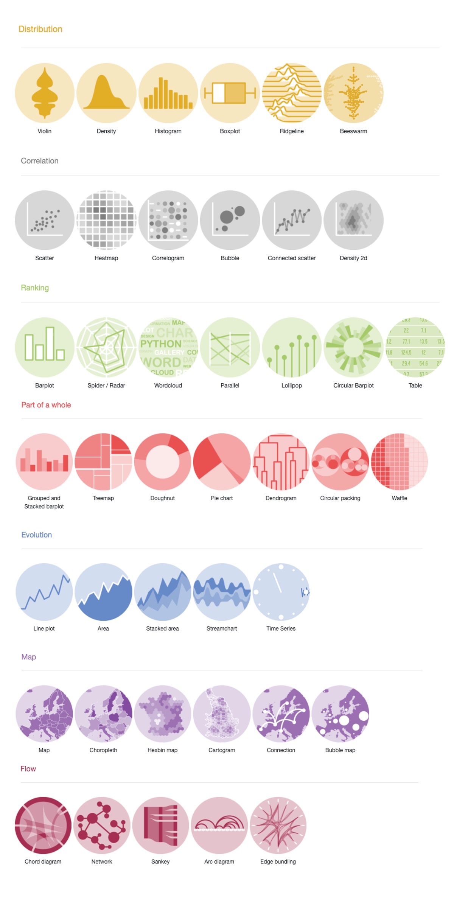

```{r setup, include=FALSE}
knitr::opts_chunk$set(echo = TRUE)
```

## 1. Introduction


### 1.1 Understanding Data Types

When visualizing data, it’s essential to define what type of information you want to convey. Each data type tells a different story and requires specific graphs to best represent it. If you don't have a clear idea of what you want your figure to convey neither will your audience. Take some time to define the message. Here are some broad categories to consider:

1. **Distribution**: Visualizing the spread or distribution of values within a dataset helps identify patterns, clusters, and outliers.
   
2. **Correlation**: Use this approach to show the relationship between two or more variables, highlighting how changes in one variable may be associated with changes in another.
   
3. **Ranking**: When you want to compare and rank items, particularly for categorical data.

4. **Part of a Whole**: Show the proportion of each category as part of the total to highlight the relative importance or size of different components.
   
5. **Evolution (Over Time)**: When the goal is to track changes in data over a period of time.


### 1.2 Crafting an Effective Data Story

Once you’ve identified the type of information you want to represent, the next step is to ensure your visualization tells a clear and compelling story. The way you use visual elements—such as color, shape, size, and position—can significantly influence how your audience interprets the data.


#### 1. **Clarify Your Message**

   - As scientists, it’s tempting to include all the data you’ve collected, but more data isn’t always better. Focus on the data points that directly support your key message. Too much information can overwhelm your audience and dilute your narrative.
   
   - **Best Practices**:
   
     - Highlight only the most relevant data to avoid clutter.
     
     - Use concise titles and annotations to reinforce your main point.
     
     - Ensure each element of the graph serves a purpose in telling the story.
     

#### 2. **Prioritize Visual Clarity**

   - Simplify complex data by using the right type of graph and minimizing unnecessary design elements. Clear visuals allow your audience to grasp insights quickly.
   
   - **Best Practices**:
   
     - Use a consistent style across your plots.
     
     - Avoid unnecessary gridlines or excessive labeling.
     
     - Ensure axes are appropriately scaled and labeled.
     

#### 3. **Leverage Color, Shape, and Size Intentionally**

   - **Color**: Draw attention to or categorize data points.
   
   - **Shape**: Differentiate between groups when multiple variables are present.
   
   - **Size**: Indicate magnitude or importance.
   
   - **Position**: Align data logically to reveal relationships and trends.

Each design choice should enhance comprehension and guide the viewer toward your intended conclusion. A well-crafted visualization doesn’t just present data—it communicates an impactful story that’s easy to follow.


### 1.3 Why R?

R provides a robust set of tools to create these diverse visualizations. With packages like `ggplot2`, `plotly`, and others, R allows you to build insightful and customized visualizations that align with your data's narrative. Selecting the right graph type and refining it with R’s tools will make your data visualization more powerful and effective.

Check out all the different plot options in R here <https://r-graph-gallery.com/>.



### 1.4 Understanding Long vs Wide Data Format

#### What is Long vs Wide Data?
When working with datasets, it's important to understand how the structure of your data impacts your ability to analyze or visualize it. 

- **Wide Data**: 
  - Each variable is stored in its own column.
  - Example:
  
    | Group | Value_1 | Value_2 |
    |-------|---------|---------|
    | A     | 10      | 30      |
    | B     | 15      | 25      |
    | C     | 20      | 35      |

- **Long Data**:
  - Each row represents an observation, and variable names and their values are stored in separate columns.
  - Example (after pivoting wide to long):

    | Group | Variable | Value |
    |-------|----------|-------|
    | A     | Value_1  | 10    |
    | A     | Value_2  | 30    |
    | B     | Value_1  | 15    |
    | B     | Value_2  | 25    |
    | C     | Value_1  | 20    |
    | C     | Value_2  | 35    |

#### Why Does This Matter?
Many visualization tools, including `ggplot2`, work best with long data because they rely on mapping variables (like `Variable` and `Value` above) to plot aesthetics. If your dataset is in wide format, you might encounter errors or difficulties creating the desired plot.

#### Reshaping Data with `tidyr`
The `tidyr` package in R provides simple tools to transform data between wide and long formats. Here’s an example using the `pivot_longer()` function:

```{r, message=FALSE, warning=FALSE}
# Install libraries if necessary
if (!requireNamespace("tidyr", quietly = TRUE)) {
  install.packages("tidyr")
}


# Example wide dataset
wide_data <- data.frame(
  Group = c("A", "B", "C"),
  Value_1 = c(10, 15, 20),
  Value_2 = c(30, 25, 35)
)

# Convert wide data to long format
library(tidyr)

long_data <- wide_data %>%
  pivot_longer(
    cols = starts_with("Value"),  # Columns to pivot
    names_to = "Variable",        # New column for variable names
    values_to = "Value"           # New column for values
  )

# View the transformed data
print(long_data)

```

After pivoting, you can use ggplot2 to map `Variable` and `Value` to different aesthetics, like colors or axes, and create your visualizations.

If you need to switch back to wide format, use the `pivot_wider()` function. For example:


```{r, message=FALSE, warning=FALSE}
wide_again <- long_data %>%
  pivot_wider(
    names_from = "Variable",  # Column names
    values_from = "Value"     # Values for those columns
  )

print(wide_again)

```


We will encounter dataset formats later.


### 1.5 Introduction to ggplot2

Data visualization in R is both powerful and flexible, thanks to its diverse ecosystem of plotting tools. Among these, `ggplot2` stands out as a gold standard for creating elegant and informative graphics. Built on the Grammar of Graphics, `ggplot2` provides a structured, layered approach to building visualizations, making it intuitive for both basic and complex plots.

<div style="border: 1px solid #4CAF50; background-color: #e8f5e9; padding: 10px; border-radius: 5px;">
**Tip:** Checkout [ggplot2](https://ggplot2.tidyverse.org/) for more information and cheat sheets!
</div>

#### Why ggplot2?

The Grammar of Graphics, which `ggplot2` is based on, allows users to think of plots as layers of data and aesthetic mappings. This approach provides several key benefits:

- **Consistency and Flexibility**: Each plot element (e.g., points, lines, axes) is a layer that can be easily customized or combined.

- **High-Quality Visuals**: `ggplot2` is capable of creating publication-ready plots.

- **Scalability**: Whether you're making a simple scatter plot or a multi-faceted figure, `ggplot2` can handle it efficiently.


#### A Quick Recap of R's Plotting Ecosystem

While base R provides essential functions like `plot()`, `hist()`, and `boxplot()`, these are limited in their customization and consistency. Other packages like `lattice` offer more capabilities, but `ggplot2` stands out for its flexibility, ease of use, and extensive community support.

#### The Grammar of Graphics Framework

At its core, `ggplot2` operates on three main components:

1. **Data**: The dataset you want to visualize.

2. **Aesthetics (aes)**: Mapping of variables to visual properties like position, color, and size.

3. **Geometries (geoms)**: The type of plot to draw, such as points, lines, or bars.


For example, a basic scatter plot is constructed as follows:

```{r, message=FALSE}
# Install libraries if necessary
if (!requireNamespace("ggplot2", quietly = TRUE)) {
  install.packages("ggplot2")
}

library(ggplot2)

# Get our dataset
data("mtcars")

# Basic scatter plot of mpg vs wt from the mtcars dataset 
ggplot(data = mtcars, aes(x = wt, y = mpg)) +
  geom_point()

```


In this example:

- The `data` is mtcars, a built-in dataset in R.

- The `aes` mapping defines wt (weight) as the x-axis and mpg (miles per gallon) as the y-axis.

- The geometry `geom_point()` plots the data as points.


#### Layers and Customization

Let's adjust our plot to account for the number of cylinders. For each number of cylinders, we will use distinct colors, add an individual regression line, titles, and a clean theme:

<div style="border: 1px solid #2196F3; background-color: #E3F2FD; padding: 10px; border-radius: 5px;">
**Note:** A regression line is a straight line that shows how one variable changes in relation to another, helping to illustrate their relationship.
</div>


```{r, message=FALSE}
ggplot(mtcars, aes(x = wt, y = mpg, color = factor(cyl))) +
  geom_point(size = 3) +
  geom_smooth(method = "lm", se = FALSE) +
  labs(title = "Scatter Plot of MPG vs. Weight",
       x = "Weight (1000 lbs)",
       y = "Miles per Gallon",
       color = "Cylinders") +
  theme_classic()

```

#### Understanding the Updated Plot

With just a few more lines of code, our plot looks significantly better. Let’s break down how the updated plot works.

#### 1. **Aesthetic Mapping**

- We added `cyl` into our `aes` for the plot. Since we added it as a factor `color =` uses distinct colors for each number of cylinders (4, 6, or 8). If we did not include `factor` our colors would have been on a scale which is great for continuous variables but not distinct like we want for categorical data.

<div style="border: 1px solid #D32F2F; background-color: #FFEBEE; padding: 10px; border-radius: 5px;">
**Warning:** Factors in R are used to represent categorical data as numbers, which are automatically assigned based on the alphabetical order of the categories. While this can be useful, it may sometimes lead to unexpected behavior or errors, especially when the default ordering doesn’t match the intended logic. 
</div>

#### 2. **Geometries**

- We added `geom_smooth()` to include a regression line for each category of cylinders, this is because we separated out `cyl` in our `aes`.

#### 3. **Layering**

- `ggplot2` layers based on order, since we placed `geom_smooth()` after `geom_point()`, the lines lay on top of the points. Switching the order changes this.

#### 4. **Labels and Themes**

- The plot includes a title, axis labels, and a legend, which provide context and explain the elements.
  - `title =`: The title describes the figure (e.g., "Miles per Gallon vs. Weight").
  - `x =` and `y =`: The axis titles (e.g., weight on the x-axis and MPG on the y-axis).
  - `color =`: Gives a ledgend for the color element, indicating the number of cylinders.
  - `theme_classic` is applied to reduce visual clutter like background.


## 2. Getting Started Plotting


### 2.1 Scatter Plot Structure

Let's start with a classic--scatter plots. These are great for visualizing the relationship between two continuous variables. 

**Basic Scatter Plot**

Let’s start with a simple scatter plot to visualize how car weight (wt) relates to miles per gallon (mpg):

```{r, message=FALSE}
# Define data, aes, and geom
ggplot(data = mtcars, aes(x = wt, y = mpg)) +
  geom_point()

```


<div style="border: 1px solid #2196F3; background-color: #E3F2FD; padding: 10px; border-radius: 5px;">
**Note:** `ggplot2` automatically treats the first argument as the dataset, even if you don’t explicitly write `data =`. For example, `ggplot(mtcars, aes(...` works the same as `ggplot(data = mtcars, aes(...`. 
</div>


Now, let’s add some color to differentiate cars by the number of cylinders (cyl):

```{r, message=FALSE}
# Add color to aes
ggplot(data = mtcars, aes(x = wt, y = mpg, color = cyl)) +
  geom_point()

```

Since `cyl` is a numerical variable, `ggplot2` uses a continuous color scale. If we want to treat `cyl` as a categorical variable and use discrete colors, we can use `factor`, which is used to represent categorical data as numbers. So each number of `cyl` will be a discrete color instead of on a gradient.

```{r, message=FALSE}
# Add color to aes as a factor
ggplot(data = mtcars, aes(x = wt, y = mpg, color = factor(cyl))) +
  geom_point()
```


Next, let’s explore how weight impacts fuel efficiency by adding a regression line:

```{r, message=FALSE}
# Add regression line
ggplot(data = mtcars, aes(x = wt, y = mpg, color = factor(cyl))) +
  geom_point() +
  geom_smooth(method = "lm")

```

Let's note a few things here:

- The `method = "lm"` argument fits a linear regression model.

- By default, the regression line includes a shaded 95% confidence interval.

- Since we’re grouping by `cyl` in the `aes()`, separate regression lines are plotted for each cylinder group. 

If we want a single regression line while still coloring points by cylinder group, we can adjust where the color aesthetic is applied:

```{r, message=FALSE}

# Add one regression line
ggplot(data = mtcars, aes(x = wt, y = mpg)) +
  geom_point(aes(color = factor(cyl))) +
  geom_smooth(method = "lm")

```

Here, the color is only applied to `geom_point()`, so the regression line represents the overall trend, not individual groups.


----

### 2.2 Customizing Plots

ggplot2 offers extensive customization options, far beyond what we can explore in a single workshop. Each element of a graph can be tailored to fit specific needs. For instance, we can easily adjust the appearance of our plots by modifying individual attributes within our geoms. Let's remove the confidence interval and make the line black with `se =` and `color =`.

```{r, message=FALSE}
# Add one black regression line without se
ggplot(data = mtcars, aes(x = wt, y = mpg)) +
  geom_point(aes(color = factor(cyl))) +
  geom_smooth(method = "lm", se = FALSE, color = "black")
```

<div style="border: 1px solid #4CAF50; background-color: #e8f5e9; padding: 10px; border-radius: 5px;">
**Tip:** The order of layers in ggplot2 determines their appearance on the plot. By reversing `geom_smooth()` and `geom_point()`, we can position the regression line behind the points, changing the visual priority of these elements.
</div>

$~$

Let’s further enhance our visualization by changing the line to a dashed style, increasing the point size, and transparency. We’ll do this by adding the `size =`, `linetype =`, and `alpha =` parameters directly in our geoms.


```{r, message=FALSE}

ggplot(data = mtcars, aes(x = wt, y = mpg)) +
  geom_point(aes(color = factor(cyl)), size = 5, alpha = 0.8) + # Adjust size and transparency
  geom_smooth(method = "lm", se = FALSE, color = "black", linetype = "dashed") # Change line type
```


<div style="border: 1px solid #2196F3; background-color: #E3F2FD; padding: 10px; border-radius: 5px;">
**Note:** The `size =` parameter is specified directly within `geom_point()`, not within the `aes()` function. Consider the visual impact on the plot if `size =` were to be included inside `aes()`, which would dynamically adjust point sizes based on data values.
</div>

----

### Try it for yourself: 

Change the code to increase the regression line thickness.

```{r eval=FALSE}

ggplot(data = mtcars, aes(x = wt, y = mpg)) +
  geom_point(aes(color = factor(cyl)), size = 5, alpha = 0.8) +
  geom_smooth(method = "lm", se = FALSE, color = "black", linetype = "dashed")

```


Let's show more information. We can change the shape of `cyl`, so they're still differentiated, but also change the color to show horsepower. 

```{r, message=FALSE}

ggplot(data = mtcars, aes(x = wt, y = mpg)) +
  geom_point(aes(color = hp, shape = factor(cyl)), size = 5, alpha = 0.8) +
  geom_smooth(method = "lm", se = FALSE, color = "black", linetype = "dashed")

```


### Try it for yourself:
 
 
To make adjustments, let's first take a look at the variables we have to work with:
 
```{r}
head(mtcars)
```

The mtcars dataset contains data on 32 car models, with the following columns:

- **mpg:** Miles per gallon (fuel efficiency).

- **cyl:** Number of cylinders in the engine (4, 6, or 8).

- **disp:** Engine displacement (in cubic inches).

- **hp:** Gross horsepower.

- **drat:** Rear axle ratio.

- **wt:** Weight of the car (in 1000s of pounds).

- **qsec:** 1/4 mile time (time in seconds to cover a quarter mile).

- **vs:** Engine shape (0 = V-shaped, 1 = straight).

- **am:** Transmission type (0 = automatic, 1 = manual).

- **gear:** Number of forward gears.

- **carb:** Number of carburetors.
 
 
 Choose two different variables by which to color and shape the points:
 
 
 
```{r, eval=FALSE}

ggplot(data = mtcars, aes(x = wt, y = mpg)) +
  geom_point(aes(color = ,              #Fill in 
                 shape = ),             #Fill in
             size = 5, alpha = 0.8) +
  geom_smooth(method = "lm", se = FALSE, color = "black", linetype = "dashed")


```


## 3. Summary

In this training, we explored the powerful capabilities of ggplot2 for data visualization in R, emphasizing how it structures plots through data, aesthetics (aes), and geometries (geoms). We used the `mtcars` dataset to demonstrate aesthetic adjustments like color and size and discussed layering. In the next part, we will show plotting summary data, raw data, and more customization. 


<div style="padding-bottom: 100px;"></div>

