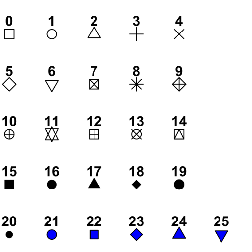
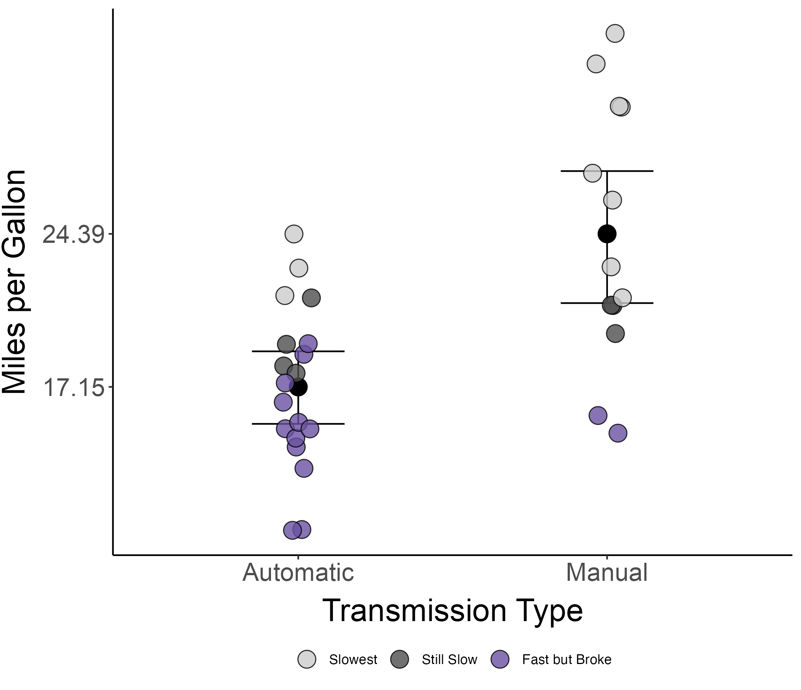
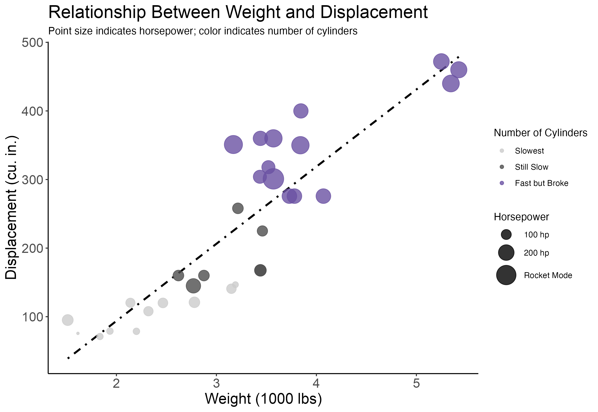

```{r setup, include=FALSE}
knitr::opts_chunk$set(echo = TRUE)
```

## 1. Introduction


### 1.1 Recap

In the previous session, we delved into the versatility of the R package ggplot2. ggplot2 makes visualizations in data layers, aesthetics (aes), and geometries (geoms).

We explored three core components:

1. **Data**: The dataset you're visualizing.
2. **Aesthetics (aes)**: How data variables are visually represented, such as position, color, and size.
3. **Geometries (geoms)**: The plot types or elements, like points, lines, or bars, used to display data.

We practiced creating simple scatter plots and enhanced them by differentiating data points, such as by cylinder count in the `mtcars` dataset, using aesthetic mappings. We also learned to layer these elements to add complexity, including adding regression lines to show trends. We covered customization techniques in ggplot2, adjusting visual elements like line types and point sizes.

In this session, we will build on these skills, introducing more advanced data manipulation and visualization strategies to further enhance our data narratives with ggplot2.


### 1.2 Overview

In this session, we will learn about plotting summary and raw data as well as delve deeper into plot customization.  

Before we make our figures, let's review our working dataset about cars. 

```{r}
# View the built-in dataset
head(mtcars)
```

The mtcars dataset contains data on 32 car models, with the following columns:

- **mpg:** Miles per gallon (fuel efficiency).

- **cyl:** Number of cylinders in the engine (4, 6, or 8).

- **disp:** Engine displacement (in cubic inches).

- **hp:** Gross horsepower.

- **drat:** Rear axle ratio.

- **wt:** Weight of the car (in 1000s of pounds).

- **qsec:** 1/4 mile time (time in seconds to cover a quarter mile).

- **vs:** Engine shape (0 = V-shaped, 1 = straight).

- **am:** Transmission type (0 = automatic, 1 = manual).

- **gear:** Number of forward gears.

- **carb:** Number of carburetors.
 

In the dataset, we have categorical data (`cyl`, `vs`, `am`, `gear`, `carb`) and continuous data (`mpg`, `disp`, `hp`, `drat`, `wt`, `qsec`).

----

## 2. Data Summarization

### 2.1 Reviewing the Data

Before we delve into making figures, we need to understand our data by exploring its distribution. Visualizing different variables in our dataset not only helps us identify patterns and trends but also highlights how the distribution of values can influence the statistical methods we use and the insights we draw.

```{r}
# Load libraries and data
library(ggplot2)
data("mtcars")

ggplot(mtcars, aes(x=mpg)) + geom_histogram(binwidth=1)
```

The `binwidth` in `geom_histogram()` determines the width of each bin, which groups the data into intervals along the x-axis to create the histogram; smaller binwidths result in more detailed distributions, while larger binwidths provide a broader summary.

```{r}

ggplot(mtcars, aes(x=mpg)) + geom_histogram(binwidth=0.5)

```


```{r}

ggplot(mtcars, aes(x=mpg)) + geom_histogram(binwidth=1.5)

```


Too large of bins may obscure the data.

```{r}
ggplot(mtcars, aes(x=mpg)) + geom_histogram(binwidth=10)
```

Let's look at our next variable of interest: `cyl`. If you run the following code you will get an error. 

```{r, eval=FALSE}
ggplot(mtcars, aes(x=factor(cyl))) + geom_histogram(binwidth = 1)

```

The error occurs because `geom_histogram()` expects a continuous variable on the x aesthetic to calculate bins, while `factor` creates a discrete variable. In this case, we could remove `factor` since our variable is numeric.


```{r}
ggplot(mtcars, aes(x=cyl)) + geom_histogram(binwidth = 1)
```

However, `geom_bar()` is used for categorical variables.

```{r}

ggplot(mtcars, aes(x = factor(cyl))) +   # Factor again for categorical
  geom_bar()

```


Look at the distribution of `qsec` in the code block below:

```{r, eval=FALSE}


```


### 2.2 Plotting Summary Statistics with dplyr

We can efficiently summarize our data for visualization using the `dplyr` package. This allows us to plot means and standard errors. 

First, install and load the necessary libraries:


```{r, message=FALSE}
# Install libraries if necessary
if (!requireNamespace("dplyr", quietly = TRUE)) {
  install.packages("dplyr")
}

if (!requireNamespace("tidyverse", quietly = TRUE)) {
  install.packages("tidyverse")
}

# Load libraries
library(dplyr)
library(tidyverse)                                 # data manipulation
```


Now let's aggregate and summarize the `mtcars` dataset by the number of cylinders (`cyl`). We will calculate mean and standard deviation for miles per gallon (`mpg`) and quarter-mile time (`qsec`), and then derive standard errors and confidence intervals:


```{r, message=FALSE}
mtcars_summary <- mtcars %>%
  group_by(cyl) %>%  # Group by the number of cylinders
  summarise(
    mpg_mean = mean(mpg, na.rm = TRUE),  # mpg mean
    mpg_sd = sd(mpg, na.rm = TRUE),      # mpg standard deviation
    mpg_n = n(),                         # mpg count
    qsec_mean = mean(qsec, na.rm = TRUE),  # qsec mean
    qsec_sd = sd(qsec, na.rm = TRUE),      # qsec standard deviation
    qsec_n = n()                           # qsec count
  ) %>%
  mutate(
    mpg_se = mpg_sd / sqrt(mpg_n),  # mpg standard error
    mpg_lower_ci = mpg_mean - qt(1 - (0.05 / 2), mpg_n - 1) * mpg_se,  # mpg lower 95% CI
    mpg_upper_ci = mpg_mean + qt(1 - (0.05 / 2), mpg_n - 1) * mpg_se,  # mpg upper 95% CI
    qsec_se = qsec_sd / sqrt(qsec_n),  # qsec standard error
    qsec_lower_ci = qsec_mean - qt(1 - (0.05 / 2), qsec_n - 1) * qsec_se,  # qsec lower 95% CI
    qsec_upper_ci = qsec_mean + qt(1 - (0.05 / 2), qsec_n - 1) * qsec_se   # qsec upper 95% CI
  )

```


Let's look at a bar graph comparing the average quarter mile times (`qsec_mean`) across different numbers of cylinders (`cyl`).


```{r, message=FALSE}
ggplot(data = mtcars_summary, aes(x = factor(cyl), y = qsec_mean)) +
  geom_bar(stat = "identity")
```

By default, `geom_bar()` creates a histogram, so we must specify `stat = "identity"` to correctly represent data on the x-axis. We use `factor()` for `cyl` to treat cylinder counts as discrete categories rather than continuous values.

Now, let's color the bars by the number of cylinders.


```{r, message=FALSE}
ggplot(data = mtcars_summary, aes(x = factor(cyl), y = qsec_mean, color = factor(cyl))) +
  geom_bar(stat = "identity")
```

#### Wait, why didn't that work?


In `geom_bar` (and many other geoms), the `color` attribute defines the outline of the bars, not their fill. To color the bars themselves, we need to specify the `fill` attribute.

<div style="border: 1px solid #4CAF50; background-color: #e8f5e9; padding: 10px; border-radius: 5px;">
**Tip:** Confusion between `color` and `fill` is common. Remember, `color` affects outlines or entire objects, while `fill` impacts the inside of geometric shapes. This distinction is important when setting attributes in `aes` or directly in the geoms.
</div>


$~$

Let's try again with `fill`:

```{r, message=FALSE}
ggplot(data = mtcars_summary, aes(x = factor(cyl), y = qsec_mean, fill = factor(cyl))) +
  geom_bar(stat = "identity")
```

How do we use `color` appropriately in our `geom_bar()`? 

```{r, message=FALSE}

ggplot(data = mtcars_summary, aes(x = factor(cyl), y = qsec_mean, fill = factor(cyl))) +
  geom_bar(stat = "identity", color = "black") # Color is the outline
```


Since we are visualizing the mean, let's add error bars. Error bars can be added manually or using the `Hmisc` package, which provides additional statistical functions.


```{r, message=FALSE}

# Manually adding error bars
ggplot(data = mtcars_summary, aes(x = factor(cyl), y = qsec_mean, fill = factor(cyl))) +
  geom_bar(stat = "identity") +
  geom_errorbar(aes(ymin = qsec_lower_ci, ymax = qsec_upper_ci)) 
```


### 2.3 Plotting Summary Statistics with Hmisc

The `Hmisc` package can automate the calculation of summary statistics and their visualization. It is especially useful for more complex statistical summaries that go beyond the basics provided by ggplot2.


```{r, message=FALSE}
# Install and load the Hmisc package
if (!requireNamespace("Hmisc", quietly = TRUE)) {
  install.packages("Hmisc")
}
library(Hmisc)

# Use the regular dataset and not the summary we made
ggplot(data = mtcars, aes(x = factor(cyl), y = qsec, fill = factor(cyl))) +
  stat_summary(fun = mean, geom = "bar") + 
  stat_summary(fun.data = mean_cl_boot, geom = "errorbar") # Add error bars showing confidence intervals
```


Let's switch to using points for the means along with error bars for a closer view.

```{r, message=FALSE}

ggplot(data = mtcars, aes(x = factor(cyl), y = qsec, color = factor(cyl))) +
  stat_summary(fun = mean, geom = "point", size = 5) + 
  stat_summary(fun.data = mean_cl_boot, geom = "errorbar")
  
```

$~$

We are now using the `color` attribute to modify our points because, the `color` attribute changes the entire appearance of standard points, which don't have a separate fillable area. The `fill` attribute is only applicable to points that have both fillable interiors and outlines. Let's make further adjustments, noting that we can modify specific parts of the figure by tweaking individual `geom` elements.


```{r, message=FALSE}
ggplot(data = mtcars, aes(x = factor(cyl), y = qsec, color = factor(cyl))) +
  stat_summary(fun = mean, geom = "point", size = 5) + 
  stat_summary(fun.data = mean_cl_boot, geom = "errorbar",
    color = "black", width = 0.2)
```

<div style="border: 1px solid #2196F3; background-color: #E3F2FD; padding: 10px; border-radius: 5px;">
**Note:** Did you notice the slight change in the figure legend? If your legend doesn't seem appropriate check the location and features being pulled from your `aes`.
</div>

$~$

Let's also adjust our layers:

```{r, message=FALSE}
ggplot(data = mtcars, aes(x = factor(cyl), y = qsec, color = factor(cyl))) +
  stat_summary(fun.data = mean_cl_boot, geom = "errorbar",
    color = "black", width = 0.2) +
  stat_summary(fun = mean, geom = "point", size = 5)
```

By reordering we have layered the error bars behind the points. 

### 2.4 Why Bar Plots are Bad

**Example:**
We are collecting the same data from two different sites (green and purple), both have the same mean (100) and the same standard deviation (15).

**Question:**
Are the two datasets alike?

Let's collect our data:

```{r, warning=FALSE, message=FALSE}
set.seed(123)  # For reproducibility

# Red data
red_data <- rnorm(1000, mean = 100, sd = 15)

# Blue data (using exponential distribution scaled to match mean and SD of normal)
blue_data <- rexp(1000, rate = 0.1)
desired_mean <- mean(red_data)
desired_sd <- sd(red_data)
blue_data <- (blue_data - mean(blue_data)) / sd(blue_data) * desired_sd + desired_mean

# Combine into a data frame
data <- data.frame(
  group = rep(c("Red", "Blue"), each = length(red_data)),
  value = c(red_data, blue_data)
)

data$group <- factor(data$group, levels = c("Red", "Blue"))

# View our data

head(data)

```
Let's look at the distributions:

```{r, warning=FALSE, message=FALSE}

ggplot(data, aes(x = value, fill = group)) +
  geom_histogram(binwidth = 5) +
  facet_wrap(~ group) +
  labs(title = "Clearly Different Distributions")

```

```{r, warning=FALSE, message=FALSE}
ggplot(data, aes(x = group, y = value, fill = group)) +
  geom_boxplot() +
  labs(title = "Still Looks Different")

```


```{r, warning=FALSE, message=FALSE}

ggplot(data, aes(x = group, y = value, fill = group)) +
  stat_summary(fun.data = mean_cl_boot, geom = "errorbar", width = 0.4) +
  stat_summary(fun = mean, geom = "bar", color = "black", width = 0.6) +
  labs(title = "They Look the Same!")

```

#### Friends Don't Let Friends Make Barplots


----

## 3. Plotting Raw Data

As we just saw, relying solely on summary statistics like means or medians can sometimes obscure the underlying distribution and variability present in your dataset. Displaying raw data alongside summary statistics offers a more comprehensive view, revealing outliers, data distribution patterns, and potential anomalies that summary measures alone might miss. This approach enhances transparency and provides a fuller understanding of the data's behavior. In this section, we'll explore various methods to effectively incorporate raw data into our visualizations.

Let's create a few standard plots that incorporate the full dataset:

$~$

#### Boxplot


Boxplots are statistical visualizations that succinctly represent the distribution of data through quartiles and outliers. They highlight the median, range, and variability within a dataset, making it easy to compare distributions across different groups or variables.


```{r, message=FALSE}
ggplot(data = mtcars, aes(x = factor(cyl), y = qsec, fill = factor(cyl))) +
  geom_boxplot()
```

$~$


#### Violin Plot

Violin plots are similar to boxplots but provide a deeper insight into the distribution of data, showing the probability density of the data at different values. These plots are particularly useful for revealing multiple modes or peaks in the data, displaying both the spread and the density of the data points.


```{r, message=FALSE}
ggplot(data = mtcars, aes(x = factor(cyl), y = qsec, fill = factor(cyl))) +
  geom_violin(draw_quantiles = 0.5)
```

$~$

#### Raw Data Points

Plotting raw data as points is a straightforward method to visually assess the distribution, trends, and potential anomalies within a dataset. This allows for a direct observation of each data point, helping to identify patterns, outliers, and the overall spread of data across different categories or variables.

```{r, message=FALSE}
ggplot(data = mtcars, aes(x = factor(cyl), y = qsec, color = factor(cyl))) + # Switch back to color
  geom_point(size = 5)
```

$~$

#### Plotting Raw Data and Summary Stats

Plotting raw data points alongside summary statistics like the mean and error bars provides a comprehensive view of the data. Let's plot our raw data points with the mean and error bars overlayed:

```{r, message=FALSE}

ggplot(data = mtcars, aes(x = factor(cyl), y = qsec, color = factor(cyl))) +
  geom_point(size = 5) +
  stat_summary(fun.data = mean_cl_boot, geom = "errorbar",
        color = "black", width = 0.2) +
  stat_summary(fun = mean, geom = "point",
    size = 5, color = "black")


```

### Now we have a(n ugly) figure! 

----

## 4. Customizing Figures

### 4.1 Themes

The default grey background in `ggplot2` figures can often distract from the data being presented. Fortunately, `ggplot2` offers a variety of themes that can enhance the visual appeal and clarity of your figures. For example, `theme_classic()` provides a clean, traditional look with no background grid and a white plot area, making it suitable for publication. You can apply this theme easily by appending it to your ggplot chain to instantly improve the aesthetics of your plot.


```{r, message=FALSE}

ggplot(data = mtcars, aes(x = factor(cyl), y = qsec, color = factor(cyl))) +
  geom_point(size = 5) +
  stat_summary(fun.data = mean_cl_boot, geom = "errorbar",
        color = "black", width = 0.2) +
  stat_summary(fun = mean, geom = "point",
    size = 5, color = "black") +
  theme_classic()

```


Much better! Try out `theme_minimal()` and `theme_bw()`.

```{r, eval = FALSE}

ggplot(data = mtcars, aes(x = factor(cyl), y = qsec, color = factor(cyl))) +
  geom_point(size = 5) +
  stat_summary(fun.data = mean_cl_boot, geom = "errorbar",
        color = "black", width = 0.2) +
  stat_summary(fun = mean, geom = "point",
    size = 5, color = "black") +                 # Add your theme here
  


```


Additionally, we can set a global theme that ggplot will use for every figure. 

```{r, message=FALSE}
# Set our theme to classic
theme_set(theme_classic())
```


Now the rest of our figures will have this theme. 


```{r, message=FALSE}
ggplot(data = mtcars, aes(x = factor(cyl), y = qsec, color = factor(cyl))) +
  geom_point(size = 5) +
  stat_summary(fun.data = mean_cl_boot, geom = "errorbar",
        color = "black", width = 0.2) +
  stat_summary(fun = mean, geom = "point",
    size = 5, color = "black")
```


### 4.2 Shapes and Colors

In R, the `pch` argument allows you to specify the shape of points in plots, offering a variety of options to customize their appearance. There are 25 built-in point shapes, ranging from simple circles and squares to more complex symbols like stars and triangles. Shapes 0-14 are open (e.g., hollow squares or circles), while shapes 15-18 are solid. Shapes 19-25 include filled and special symbols, such as filled circles and diamonds. You can change the color of the points using the `color` argument, which affects the border or `fill` depending on the shape. For filled shapes (e.g., pch = 19), `color` changes the entire point's color, while for open shapes (e.g., pch = 1), it only changes the border color. This flexibility can be highly advantageous but sometimes confusing.




Let's use 21 for our points. 

```{r, message=FALSE}
ggplot(data = mtcars, aes(x = factor(cyl), y = qsec, color = factor(cyl))) +
  geom_point(size = 5, pch = 21) +
  stat_summary(fun.data = mean_cl_boot, geom = "errorbar",
        color = "black", width = 0.2) +
  stat_summary(fun = mean, geom = "point",
    size = 5, color = "black") 
  
```


Since we've specified `color`, it affects the outline of the points. We'll adjust `geom_point()` to set the outline color to black, and use `aes` to assign `fill` to color the interior of the points based on `cyl`.


```{r, message=FALSE}

ggplot(data = mtcars, aes(x = factor(cyl), y = qsec)) +
  geom_point(size = 5, pch = 21, color = "black", aes(fill = factor(cyl))) +
  stat_summary(fun.data = mean_cl_boot, geom = "errorbar",
        color = "black", width = 0.2) +
  stat_summary(fun = mean, geom = "point",
    size = 5, color = "black") 

```

$~$


Notice how we set the `color` attribute to define the outline of the points. By specifying this inside the `geom_point()`, we can freely choose any outline color.


```{r, message=FALSE}
ggplot(data = mtcars, aes(x = factor(cyl), y = qsec)) +
  geom_point(size = 5, pch = 21, color = "hotpink", stroke = 2, # Thicken border
             aes(fill = factor(cyl))) +
  stat_summary(fun.data = mean_cl_boot, geom = "errorbar",
        color = "black", width = 0.2) +
  stat_summary(fun = mean, geom = "point",
    size = 5, color = "black") 
```


$~$

Unfortunately, the default colors in ggplot2 can be quite unappealing for polished visualizations. Thankfully, there are many ways to customize colors. You can use named colors like blue, green, darkred, and hundreds of others, or you can specify any color using hexadecimal codes (e.g., #FF5733 for a vibrant orange). ggplot2 also supports predefined palettes from the `RColorBrewer` package or continuous scales like `scale_color_gradient()`. If you need more creative options, packages like `viridis` and `wesanderson` provide aesthetically pleasing palettes that ensure readability, even for those with color blindness. It is also a good idea to pick colors associated with your data. For example, yellow and oranges when working with light or blues and greens when working with water. Let's pick some common car colors: 

- **Electric Blue:** #0074D9
- **Lime Green:** #01FF70
- **Ferrari Red:** #FF4136

```{r, message=FALSE}

ggplot(data = mtcars, aes(x = factor(cyl), y = qsec)) +
  geom_point(size = 5, pch = 21, color = "black", aes(fill = factor(cyl))) +
  stat_summary(fun.data = mean_cl_boot, geom = "errorbar",
        color = "black", width = 0.2) +
  stat_summary(fun = mean, geom = "point",
    size = 5, color = "black") +
  scale_fill_manual(values = c("#0074D9", "#01FF70", "#FF4136")) 

```


<div style="border: 1px solid #4CAF50; background-color: #e8f5e9; padding: 10px; border-radius: 5px;">
**Tip:** In this example, colors are defined in order. However, if you are making lots of plots with multiple layers it is more useful to specify colors by the value's name, in this case, the number of cylinders: `scale_fill_manual(values = c("4" = "#FF0000", "6" = "#00FF00", "8" = "#0000FF"))`.
</div>

$~$

We can also use predefined color palettes:

```{r, message=FALSE}

ggplot(data = mtcars, aes(x = factor(cyl), y = qsec)) +
  geom_point(size = 5, pch = 21, color = "black", aes(fill = factor(cyl))) +
  stat_summary(fun.data = mean_cl_boot, geom = "errorbar",
        color = "black", width = 0.2) +
  stat_summary(fun = mean, geom = "point",
    size = 5, color = "black") +
  scale_fill_brewer(palette = "Set2") 
```

You can view the color options like this:

```{r}
RColorBrewer::display.brewer.all()
```


$~$

We can also use a [color pallet generator](https://coolors.co/) for custom color pallets. This site generates random color pallets or allows you to create your own. Additionally, if you have a picture that represents your research you can upload it to generate a specialized color pallet. Let's look at a randomly generated color pallet:

```{r, message=FALSE}
ggplot(data = mtcars, aes(x = factor(cyl), y = qsec)) +
  geom_point(size = 5, pch = 21, color = "black", aes(fill = factor(cyl))) +
  stat_summary(fun.data = mean_cl_boot, geom = "errorbar",
        color = "black", width = 0.2) +
  stat_summary(fun = mean, geom = "point",
    size = 5, color = "black") +
  scale_fill_manual(values = c("#3A3238", "#6E4555", "#D282A6")) 

```


$~$

Suppose we want to highlight 8-cylinder vehicles relative to those with 4 or 6 cylinders. We'll use electric blue for the 8-cylinder vehicles to make them stand out, and a grey scale for the others. To enhance visibility and prevent overlapping, we'll apply `position_jitter` to the points, slightly offsetting them within their categories.


```{r, message=FALSE}

ggplot(data = mtcars, aes(x = factor(cyl), y = qsec)) +
  geom_point(position = position_jitter(width = 0.05),   # Slightly offset points
             size = 5, pch = 21, color = "black",
             aes(fill = factor(cyl))) +
  stat_summary(fun.data = mean_cl_boot, geom = "errorbar",
        color = "black", width = 0.2) +
  stat_summary(fun = mean, geom = "point",
    size = 5, color = "black") +
  scale_fill_manual(values = c("grey50", "grey40", "#0074D9")) 

```

$~$

### 4.3 Labels and Axes

Labels and axes are essential components of any plot, as they provide context and help the viewer interpret the data. In ggplot2, you can customize these elements using functions like `labs()` and `scale_x_continuous()` or `scale_y_continuous()`. Let's start by changing the names of our categories.

```{r, message=FALSE}
ggplot(data = mtcars, aes(x = factor(cyl), y = qsec)) +
  geom_point(position = position_jitter(width = 0.05), size = 5, pch = 21, color = "black", aes(fill = factor(cyl))) +
  stat_summary(fun.data = mean_cl_boot, geom = "errorbar",
        color = "black", width = 0.2) +
  stat_summary(fun = mean, geom = "point",
    size = 5, color = "black") +
  scale_fill_manual(
    values = c("grey50", "grey40", "#0074D9"),
    labels = c("4" = "Slowest", 
               "6" = "Still Slow", 
               "8" = "Fast but Broke")) +        # Custom legend labels
  scale_x_discrete(labels = c("4" = "Slowest", 
                              "6" = "Still Slow", 
                              "8" = "Fast but Broke"))     # Custom x axis labels

```

$~$

Let's change more labels. 

```{r, message=FALSE}

ggplot(data = mtcars, aes(x = factor(cyl), y = qsec)) +
  geom_point(position = position_jitter(width = 0.05), size = 5, pch = 21, color = "black", aes(fill = factor(cyl))) +
  stat_summary(fun.data = mean_cl_boot, geom = "errorbar",
        color = "black", width = 0.2) +
  stat_summary(fun = mean, geom = "point",
    size = 5, color = "black") +
  scale_fill_manual(
    values = c("grey50", "grey40", "#0074D9"),
    labels = c("4" = "Slowest", 
               "6" = "Still Slow", 
               "8" = "Fast but Broke")) +        # Custom legend labels
  scale_x_discrete(labels = c("4" = "Slowest", 
                              "6" = "Still Slow", 
                              "8" = "Fast but Broke")) +    # Custom x axis labels
  labs(
    x = "Engine Type",  # X-axis label
    y = "Quarter Mile Time (qsec)",  # Y-axis label
    fill = "Engine Size",  # Legend title
    title = "Quarter Mile Time by Engine Type")  # Plot title


```

$~$

We can also adjust the y-axis:

```{r, message=FALSE}

ggplot(data = mtcars, aes(x = factor(cyl), y = qsec)) +
  geom_point(position = position_jitter(width = 0.05), size = 5, pch = 21, color = "black", aes(fill = factor(cyl))) +
  stat_summary(fun.data = mean_cl_boot, geom = "errorbar",
        color = "black", width = 0.2) +
  stat_summary(fun = mean, geom = "point",
    size = 5, color = "black") +
  scale_fill_manual(
    values = c("grey50", "grey40", "#0074D9"),
    labels = c("4" = "Slowest", 
               "6" = "Still Slow", 
               "8" = "Fast but Broke")) +        # Custom legend labels
  scale_x_discrete(labels = c("4" = "Slowest", 
                              "6" = "Still Slow", 
                              "8" = "Fast but Broke")) +    # Custom x axis labels
  scale_y_continuous(breaks=c(12, 18, 24), limits=c(12,24))+ # Set axis limits and numbers
  labs(
    x = "Engine Type",  # X-axis label
    y = "Quarter Mile Time (qsec)",  # Y-axis label
    fill = "Engine Size",  # Legend title
    title = "Quarter Mile Time by Engine Type")  # Plot title


```


<div style="border: 1px solid #4CAF50; background-color: #e8f5e9; padding: 10px; border-radius: 5px;">
**Tip:** This is great for standardizing multiple plots. You can also use `scale_x_continuous()` in the same way.
</div>

$~$

We can also edit the sizes and fonts of the axis:

```{r, message=FALSE}

ggplot(data = mtcars, aes(x = factor(cyl), y = qsec)) +
  geom_point(position = position_jitter(width = 0.05), size = 5, pch = 21, color = "black", aes(fill = factor(cyl))) +
  stat_summary(fun.data = mean_cl_boot, geom = "errorbar",
        color = "black", width = 0.2) +
  stat_summary(fun = mean, geom = "point",
    size = 5, color = "black") +
  scale_fill_manual(
    values = c("grey50", "grey40", "#0074D9"),
    labels = c("4" = "Slowest", 
               "6" = "Still Slow", 
               "8" = "Fast but Broke")) +        # Custom legend labels
  scale_x_discrete(labels = c("4" = "Slowest", 
                              "6" = "Still Slow", 
                              "8" = "Fast but Broke")) +    # Custom x axis labels
  scale_y_continuous(breaks=c(12, 18, 24), limits=c(12,24))+ # Set axis limits and numbers
  labs(
    x = "Engine Type",  # X-axis label
    y = "Quarter Mile Time (qsec)",  # Y-axis label
    fill = "Engine Size") + # Legend title
  theme(
    axis.title.x = element_text( size=24, family= "Times", vjust=-0.2),
    axis.text.x  = element_text( size=16, family= "Times"),
    axis.title.y = element_text( size=24, family= "Times", vjust=2), # vjust is the distance from the text
    axis.text.y  = element_text( size=16, family= "Times"),
    legend.position = "none")


```

#### Try it for yourself:

Edit the plot yourself: chose different colors, shapes, titles, and adjustments:


```{r, eval=FALSE}

ggplot(data = mtcars, aes(x = factor(cyl), y = qsec)) +
  geom_point(position = position_jitter(width = 0.05), size = 5, pch = 21, color = "black", aes(fill = factor(cyl))) +
  stat_summary(fun.data = mean_cl_boot, geom = "errorbar",
        color = "black", width = 0.2) +
  stat_summary(fun = mean, geom = "point",
    size = 5, color = "black") +
  scale_fill_manual(
    values = c("grey50", "grey40", "#0074D9"),
    labels = c("4" = "Slowest", 
               "6" = "Still Slow", 
               "8" = "Fast but Broke")) +        # Custom legend labels
  scale_x_discrete(labels = c("4" = "Slowest", 
                              "6" = "Still Slow", 
                              "8" = "Fast but Broke")) +    # Custom x axis labels
  scale_y_continuous(breaks=c(12, 18, 24), limits=c(12,24))+ # Set axis limits and numbers
  labs(
    x = "Engine Type",  # X-axis label
    y = "Quarter Mile Time (qsec)",  # Y-axis label
    fill = "Engine Size") + # Legend title
  theme(
    axis.title.x = element_text( size=20, family= "Times", vjust=-0.2),
    axis.text.x  = element_text( size=16, family= "Times", angle = 45, hjust=1, margin=margin(t=-1, b=10)),
    axis.title.y = element_text( size=20, family= "Times", vjust=2), # vjust is the distance from the text
    axis.text.y  = element_text( size=16, family= "Times"),
    axis.line.x = element_line( linewidth =3),
    legend.position = "none")


```


## 5. Example--Bubble Plot

Let's walk through an example of how to create a figure. Let's explore the life expectancy by Gross Domestic Product (GDP, a measure of a country's economic activity) per capita for each country in the year 2007 while taking into account population size.

We'll use a new dataset, provided in the `gapminder` package, and use some additional packages for color pallets and annotations. First, we need to download our data:

```{r, message=FALSE}

if (!requireNamespace("gapminder", quietly = TRUE)) {
  install.packages("gapminder")
}

library(gapminder)  
data("gapminder")
```


We are only interested in 2007 data and need to set up our data appropriately. We will filter out data for 2007 (and then remove the column year), divide our population number by 1,000,000 (to make the numbers easier to work with), sort the data in descending order, and turn country into a factor. 


```{r}

# Filter out 2007 data
data <- gapminder %>% 
  filter(year=="2007") %>% 
  dplyr::select(-year)
# Changing values, sorting, and setting factor levels for plotting
data %>%
mutate(pop=pop/1000000) %>%
arrange(desc(pop)) %>%
mutate(country = factor(country)) 

```

Now let's plot the GDP per capita by life expectancy in the year 2007, while displaying population size and coloring by continent. Let's also use the package `viridis` for our color pallet. 

```{r, message = FALSE}


# Let's install a new package for a better color pallet

if (!requireNamespace("viridis", quietly = TRUE)) {
  install.packages("viridis")
}

library(viridis)                                   # color scales 


# Plot
ggplot(data, aes(x=gdpPercap, y=lifeExp, size = pop, color = continent)) +
  geom_point(alpha=0.7) +
  scale_color_viridis(discrete=TRUE) +
  theme(legend.position="bottom")

```


The size here is not ideal and the legend is unappealing. Let's use a new scale function to address this:

```{r, message=FALSE}

# Plot
ggplot(data, aes(x=gdpPercap, y=lifeExp, size = pop, color = continent)) +
  geom_point(alpha=0.7) +
  scale_size(range = c(1, 15), guide = "none") + # set population sizes and remove legend
  scale_color_viridis(discrete=TRUE) +
  theme(legend.position="bottom")

```


Although this plot shows lots of information we may also want to point out instances that meet specific requirements we are interested in. Let's annotate countries that:

 1. GDP per capita is greater than 5,000 and life expectancy is below 60 years.
 2. GDP per capita is greater than 40,000.

ggplot is widely used and there are lots of packages that add additional features you may want to use. For these annotations we will be using `ggrepel`, you can read more about it [here](https://cran.r-project.org/web/packages/ggrepel/readme/README.html). 

We will first add a column to our dataset specifying if the country will be annotated. 


```{r, message=FALSE}

# Packge for annotations with "geom_text_repel"
if (!requireNamespace("ggrepel", quietly = TRUE)) {
  install.packages("ggrepel")
}


library(ggrepel)                                   # extra geoms for ggplot2


# Prepare data
tmp <- data %>%
mutate(annotation = case_when(
  gdpPercap > 5000 & lifeExp < 60 ~ "yes",
  gdpPercap > 40000 ~ "yes")) 


```


Next, we will create our plot and annotate it with `geom_text_repel`. We can look more into this function and how to use it by using:

```{r}
?geom_text_repel
```


Now let's create our plot:


```{r, message=FALSE}
# Plot
ggplot(tmp, aes(x=gdpPercap, y=lifeExp, size = pop, color = continent)) +
  geom_point(alpha=0.7) +
  scale_size(range = c(1, 15), guide = "none") +
  scale_color_viridis(discrete=TRUE) +
  theme(legend.position="none") + # Remove both legends for aestetics
  geom_text_repel(data=tmp %>% filter(annotation=="yes"), aes(label=country), size=4 )

```


Let's use our customization skills. 


```{r, message=FALSE}
ggplot(tmp, aes(x = gdpPercap, y = lifeExp, size = pop, color = continent)) +
  geom_point(alpha = 0.7) +
  scale_size(range = c(1.4, 19), name = "Population (Millions)") +
  scale_color_viridis(discrete = TRUE) +
  labs(
    title = "Global Economic and Health Overview",
    subtitle = "GDP per capita vs. Life Expectancy",
    x = "GDP per Capita (USD)",
    y = "Life Expectancy (years)",
    caption = "Data sourced from Gapminder"
  ) +
  theme(
    legend.position = "none",
    plot.title = element_text(size = 16, face = "bold", hjust = 0.5),
    plot.subtitle = element_text(size = 14, face = "italic", hjust = 0.5),
    plot.caption = element_text(size = 8),
    axis.title.x = element_text(size = 12),
    axis.title.y = element_text(size = 12),
    axis.text.x = element_text(size = 10),
    axis.text.y = element_text(size = 10)
  ) +
  geom_text_repel(
    data = tmp %>% filter(annotation == "yes"),
    aes(label = country),
    size = 4
  )
```


------------

## 6. Exercises

$~$

Create this image:

$~$


$~$

```{r, eval=FALSE}

# Here is some helpful code
am0 <-subset(mtcars, am == 0)
am1 <-subset(mtcars, am == 1)
mn0 <- round(mean(am0$mpg), 2)
mn1 <- round(mean(am1$mpg), 2)


# Create plot here


```

$~$

Create this image:

$~$



$~$

```{r, eval=FALSE}

```


---------

## 7. Summary

In this module, we explored various aspects of data visualization using `ggplot2` in R. We began by summarizing data using the `dplyr` package, which allowed us to compute descriptive statistics like means and standard deviations, which we visualized using bar graphs and error bars.

We then discussed the importance of displaying raw data to provide a complete picture of the dataset, beyond just summary statistics. We used boxplots, violin plots, and points to show raw data distributions and variability among groups, emphasizing how these visualizations can reveal data points and trends that summary statistics alone might obscure.

We learned to customize plots to enhance readability and aesthetic appeal. We covered:

- **Themes:** How changing the theme can dramatically alter the visual presentation of data. We focused on `theme_classic()` for its clean and professional appearance.

- **Shapes and Colors:** The use of `pch` options and color to differentiate data points visually on the plot. We discussed the difference between `color` and `fill` and how to appropriately use them.

- **Labels and Axes:** Customizing plot labels and axes to improve plot clarity and convey precise information about the data visualized. This includes modifying text and axis sizes, styles, and positions.

Remember, effective data visualization is not just about displaying data but about telling a story that is clear and engaging.


<div style="padding-bottom: 100px;"></div>
