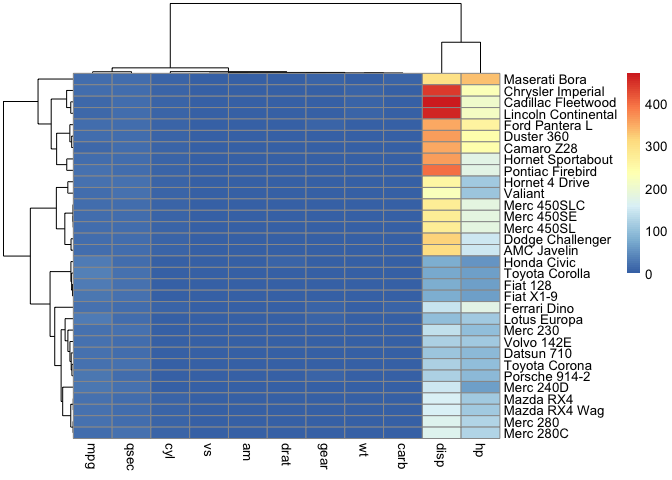

## 1. Introduction

### 1.1 Recap

Last session we plotted summary data (e.g. means), raw data, and the two combined. We customized our plots' themes, colors, shapes, labels, and titles. Let's start by loading our libraries: 


``` r
# Load libraries 
library(ggplot2)
library(dplyr)

# Set our theme to classic
theme_set(theme_classic())
```


Now, let's review the built-in R dataset about cars: 


``` r
head(mtcars)
```

```
##                    mpg cyl disp  hp drat    wt  qsec vs am gear carb
## Mazda RX4         21.0   6  160 110 3.90 2.620 16.46  0  1    4    4
## Mazda RX4 Wag     21.0   6  160 110 3.90 2.875 17.02  0  1    4    4
## Datsun 710        22.8   4  108  93 3.85 2.320 18.61  1  1    4    1
## Hornet 4 Drive    21.4   6  258 110 3.08 3.215 19.44  1  0    3    1
## Hornet Sportabout 18.7   8  360 175 3.15 3.440 17.02  0  0    3    2
## Valiant           18.1   6  225 105 2.76 3.460 20.22  1  0    3    1
```

The mtcars dataset contains data on 32 car models, with the following columns:

- **mpg:** Miles per gallon (fuel efficiency).

- **cyl:** Number of cylinders in the engine (4, 6, or 8).

- **disp:** Engine displacement (in cubic inches).

- **hp:** Gross horsepower.

- **drat:** Rear axle ratio.

- **wt:** Weight of the car (in 1000s of pounds).

- **qsec:** 1/4 mile time (time in seconds to cover a quarter mile).

- **vs:** Engine shape (0 = V-shaped, 1 = straight).

- **am:** Transmission type (0 = automatic, 1 = manual).

- **gear:** Number of forward gears.

- **carb:** Number of carburetors.
 

In the dataset, we have categorical data (`cyl`, `vs`, `am`, `gear`, `carb`) and continuous data (`mpg`, `disp`, `hp`, `drat`, `wt`, `qsec`).

Let's create our plot showing engine size by quarter-mile time:


``` r
ggplot(data = mtcars, aes(x = factor(cyl), y = qsec)) +
  geom_point(position = position_jitter(width = 0.05), size = 5, pch = 21, color = "black", aes(fill = factor(cyl))) +
  stat_summary(fun.data = mean_cl_boot, geom = "errorbar",
        color = "black", width = 0.2) +
  stat_summary(fun = mean, geom = "point",
    size = 5, color = "black") +
  scale_fill_manual(
    values = c("grey50", "grey40", "#0074D9"),
    labels = c("4" = "Slowest", 
               "6" = "Still Slow", 
               "8" = "Fast but Broke")) +        # Custom legend labels
  scale_y_continuous(breaks=c(12, 18, 24), limits=c(12,24))+ # Set axis limits and numbers
  labs(
    x = "Engine Size",  # X-axis label
    y = "Quarter Mile Time (qsec)",  # Y-axis label
    fill = "Engine Size")  # Legend title
```

<!-- -->


$~$

### 1.2 Overview


In this session, we will combine different plots, add significance bars and other annotations, save high-quality images, and learn more complex figure types. 

----

## 2. Combining Plots

### 2.1 Facet Wrap

Now, let's examine how engine size and transmission type affect quarter mile times by employing `facet_wrap()` to separate the data into distinct panels by transmission type. 


``` r
ggplot(data = mtcars, aes(x = factor(cyl), y = qsec)) +
  geom_point(position = position_jitter(width = 0.05), size = 5, pch = 21, color = "black", aes(fill = factor(cyl))) +
  stat_summary(fun.data = mean_cl_boot, geom = "errorbar",
        color = "black", width = 0.2) +
  stat_summary(fun = mean, geom = "point",
    size = 5, color = "black") +
  scale_fill_manual(
    values = c("grey50", "grey40", "#0074D9"),
    labels = c("4" = "Slowest", 
               "6" = "Still Slow", 
               "8" = "Fast but Broke")) +        # Custom legend labels
  scale_y_continuous(breaks=c(12, 18, 24), limits=c(12,24))+ # Set axis limits and numbers
  labs(
    x = "Engine Size",  # X-axis label
    y = "Quarter Mile Time (qsec)",  # Y-axis label
    fill = "Engine Size") + # Legend title
  facet_wrap(~am, labeller = as_labeller(c("0" = "Automatic", "1" = "Manual")))
```

<!-- -->

We see manual cars have a shorter quarter-mile time compared to their automatic counterpart. 

$~$

How about by engine shape?


``` r
ggplot(data = mtcars, aes(x = factor(cyl), y = qsec)) +
  geom_point(position = position_jitter(width = 0.05), size = 5, pch = 21, color = "black", aes(fill = factor(cyl))) +
  stat_summary(fun.data = mean_cl_boot, geom = "errorbar",
        color = "black", width = 0.2) +
  stat_summary(fun = mean, geom = "point",
    size = 5, color = "black") +
  scale_fill_manual(
    values = c("grey50", "grey40", "#0074D9"),
    labels = c("4" = "Slowest", 
               "6" = "Still Slow", 
               "8" = "Fast but Broke")) +        # Custom legend labels
  scale_y_continuous(breaks=c(12, 18, 24), limits=c(12,24))+ # Set axis limits and numbers
  labs(
    x = "Engine Size",  # X-axis label
    y = "Quarter Mile Time (qsec)",  # Y-axis label
    fill = "Engine Size") + # Legend title
  facet_wrap(~vs, labeller = as_labeller(c("0" = "V-Shaped", "1" = "Straight"))) 
```

<!-- -->

There are only a few V-shaped engines that are not 8 cylinders. 

$~$


What if we want to compare quarter mile and horsepower?


``` r
ggplot(data = mtcars, aes(x = factor(cyl), y = qsec)) +
  geom_point(position = position_jitter(width = 0.05), size = 5, pch = 21, color = "black", aes(fill = factor(cyl))) +
  stat_summary(fun.data = mean_cl_boot, geom = "errorbar",
        color = "black", width = 0.2) +
  stat_summary(fun = mean, geom = "point",
    size = 5, color = "black") +
  scale_fill_manual(
    values = c("grey50", "grey40", "#0074D9"),
    labels = c("4" = "Slowest", 
               "6" = "Still Slow", 
               "8" = "Fast but Broke")) +        # Custom legend labels
  scale_y_continuous(breaks=c(12, 18, 24), limits=c(12,24))+ # Set axis limits and numbers
  labs(
    x = "Engine Size",  # X-axis label
    y = "Quarter Mile Time (qsec)",  # Y-axis label
    fill = "Engine Size") + # Legend title
  facet_wrap(~hp)
```

<!-- -->

Since we can only select one `y` (and one `x`) axis this is not a good way to visualize multiple continuous variables. Instead, we need to create a longer dataset. 

$~$

### 2.2 Combining Continuous Variables with Long Data

We cannot use more than one variable on the `y` (or `x`) axis. Therefore, if we want to compare different types of continuous data, like quarter mile times (`qsec`) and horsepower (`hp`), on the same plot, we need to reformat our data from a wide format (where each type of data occupies its own column) to a long format (where all metrics are in a single column but labeled differently).

This transformation is crucial because `ggplot2` handles layers and facets more effectively when data are in a long format, especially when we want to use the same x-axis (like cylinder count) for different metrics. Let's start by looking at our data:


``` r
head(mtcars)
```

```
##                    mpg cyl disp  hp drat    wt  qsec vs am gear carb
## Mazda RX4         21.0   6  160 110 3.90 2.620 16.46  0  1    4    4
## Mazda RX4 Wag     21.0   6  160 110 3.90 2.875 17.02  0  1    4    4
## Datsun 710        22.8   4  108  93 3.85 2.320 18.61  1  1    4    1
## Hornet 4 Drive    21.4   6  258 110 3.08 3.215 19.44  1  0    3    1
## Hornet Sportabout 18.7   8  360 175 3.15 3.440 17.02  0  0    3    2
## Valiant           18.1   6  225 105 2.76 3.460 20.22  1  0    3    1
```


Let's create a column called `metric` that incorporates both `qsec` and `hp` values as `value`:


``` r
# Install libraries if necessary
if (!requireNamespace("tibble", quietly = TRUE)) {
  install.packages("tibble")
}


library(tibble)
library(tidyr)
```


``` r
mtcars_long <- mtcars %>%
  rownames_to_column(var = "car_name") %>% # Keep the row names with the cars
  pivot_longer(
    cols = c("hp", "qsec"), 
    names_to = "metric", 
    values_to = "value"
  )
```

Now let's look at our new dataset:


``` r
head(mtcars_long)
```

```
## # A tibble: 6 × 12
##   car_name      mpg   cyl  disp  drat    wt    vs    am  gear  carb metric value
##   <chr>       <dbl> <dbl> <dbl> <dbl> <dbl> <dbl> <dbl> <dbl> <dbl> <chr>  <dbl>
## 1 Mazda RX4    21       6   160  3.9   2.62     0     1     4     4 hp     110  
## 2 Mazda RX4    21       6   160  3.9   2.62     0     1     4     4 qsec    16.5
## 3 Mazda RX4 …  21       6   160  3.9   2.88     0     1     4     4 hp     110  
## 4 Mazda RX4 …  21       6   160  3.9   2.88     0     1     4     4 qsec    17.0
## 5 Datsun 710   22.8     4   108  3.85  2.32     1     1     4     1 hp      93  
## 6 Datsun 710   22.8     4   108  3.85  2.32     1     1     4     1 qsec    18.6
```

Here we can see we have added a column called `metric` that has either `hp` or `qsec` and a column called `value` that holds the numbers of each `metric`. If we look at `car_name` (we pulled this from the former row names) we see that the cars are now repeated accounting for multiple metrics per car, making our dataset twice as long.


Let's view our `metric` on the x-axis and our `value` on the y-axis:


``` r
ggplot(data = mtcars_long, aes(x = factor(cyl), y = value, fill = metric)) +
  geom_point(position = position_jitter(width = 0.05), size = 5, pch = 21, color = "black") +
  stat_summary(fun.data = mean_cl_boot, geom = "errorbar",
       color = "black", width = 0.2) +
  stat_summary(fun.data = mean_cl_boot, geom = "point",
        size = 5, color = "black")
```

<!-- -->


This is not the correct way to plot two variables. We need to separate by metric. 

$~$


Let's try again. We will plot `cyl` on the x-axis, `value` on the y-axis, and use `facet_wrap` by `metric` to separate out `qsec` and `hp` values, additionally, we will allow the y-axis scales to be free: 


``` r
ggplot(data = mtcars_long, aes(x = factor(cyl), y = value)) +
  geom_point(position = position_jitter(width = 0.05), size = 5, pch = 21, color = "black", aes(fill = factor(cyl))) +
  stat_summary(fun.data = mean_cl_boot, geom = "errorbar",
        color = "black", width = 0.2) +
  stat_summary(fun = mean, geom = "point",
    size = 5, color = "black") +
  scale_fill_manual(
    values = c("grey50", "grey40", "#0074D9"),
    labels = c("4" = "Slowest", 
               "6" = "Still Slow", 
               "8" = "Fast but Broke")) +        # Custom legend labels
  labs(
    x = "Number of Cylinders",
    y = "Value", 
    fill = "Engine Size"
  ) +
  facet_wrap(~metric, scales = "free_y",          # Allow fee y axis scales
             labeller = as_labeller(c("hp" = "Horsepower", "qsec" = "Quarter Mile Time"))
             )  
```

<!-- -->


$~$

### 2.3 Patchwork

The `patchwork` package in R is a versatile tool designed to enhance the process of arranging and combining multiple ggplot2 plots into a single, cohesive visualization. It provides a simple and intuitive syntax that allows you to easily manipulate the layout of your plots, adjust their sizes, and integrate them without the need for complex coding. Whether you're creating a grid of similar graphs or a composite of different visualizations, `patchwork` makes it straightforward.

Let's combine our plot of engine size by quarter mile time with a scatter plot of miles per gallon and weight. First, we will create a variable of our plot. Creating a plot and assigning it to a variable, like `my_plot <- ggplot(...)`, allows you to save the plot as an object in R. This approach is useful because it enables you to modify or reuse the plot later without having to recreate it from scratch. For example, you can add layers (e.g., annotations or themes), adjust settings, or save the plot to a file. It is particularly helpful for complex or frequently reused plots in workflows or reports. You simply build the base plot once and then customize or display it as needed. For example, we will start with a basic plot:


``` r
qsec_cyl <- ggplot(data = mtcars, aes(x = factor(cyl), y = qsec)) +
  geom_point(position = position_jitter(width = 0.05), 
             size = 5, 
             pch = 21, 
             color = "black", 
             aes(fill = factor(cyl))) +
  stat_summary(fun.data = mean_cl_boot, 
               geom = "errorbar",
               color = "black", 
               width = 0.2) +
  stat_summary(fun = mean, geom = "point",
    size = 5, color = "black")
```


This creates a plot as an object, to view it we print it:


``` r
qsec_cyl
```

<!-- -->


Now let's customize our plot.


``` r
qsec_cyl + scale_fill_manual(
    values = c("grey50", "grey40", "#0074D9"),
    labels = c("4" = "Slowest", 
               "6" = "Still Slow", 
               "8" = "Fast but Broke")) +        # Custom legend labels
  scale_y_continuous(breaks=c(12, 18, 24), limits=c(12,24))
```

<!-- -->


Let's customize even more:


``` r
qsec_cyl + scale_fill_manual(
    values = c("grey50", "grey40", "#0074D9"),
    labels = c("4" = "Slowest", 
               "6" = "Still Slow", 
               "8" = "Fast but Broke")) +        # Custom legend labels
  scale_y_continuous(breaks=c(12, 18, 24), limits=c(12,24)) +
  labs(
    x = "Engine Size",  # X-axis label
    y = "Quarter Mile Time (qsec)",  # Y-axis label
    fill = "Engine Size") + # Legend title
  theme_bw() +
  theme(legend.position = "none")
```

<!-- -->


We will save this plot as an object.


``` r
qsec_cyl <- qsec_cyl + scale_fill_manual(
    values = c("grey50", "grey40", "#0074D9"),
    labels = c("4" = "Slowest", 
               "6" = "Still Slow", 
               "8" = "Fast but Broke")) +        # Custom legend labels
  scale_y_continuous(breaks=c(12, 18, 24), limits=c(12,24)) +
  labs(
    x = "Engine Size",  # X-axis label
    y = "Quarter Mile Time (qsec)",  # Y-axis label
    fill = "Engine Size") + # Legend title
  theme(legend.position = "none")

qsec_cyl        # View the plot
```

<!-- -->


$~$

Now we will create a variable of our second plot called `mpg_wt`:


``` r
mpg_wt <- ggplot(data = mtcars, aes(x = wt, y = mpg)) +
  geom_point(aes(fill = factor(cyl)), pch = 21, color = "black", size = 5) +
  geom_smooth(method = "lm", se = FALSE, color = "black") +
  scale_fill_manual(
    values = c("grey50", "grey40", "#0074D9"),
    labels = c("4" = "Slowest", 
               "6" = "Still Slow", 
               "8" = "Fast but Broke")) +        # Custom legend labels
  labs(x = "Weight (1000 lbs)",
       y = "Miles per Gallon",
       fill = "Engine Size")

mpg_wt
```

<!-- -->

$~$

Now let's use the package `patchwork` to combine these two plots into one figure. Install and load the library:


``` r
# Install libraries if necessary
if (!requireNamespace("patchwork", quietly = TRUE)) {
  install.packages("pathcwork")
}

library(patchwork)
```

$~$

Then combine the plots:


``` r
# Combine out plots side by side
combined_plot <- qsec_cyl + mpg_wt

combined_plot
```

<!-- -->

$~$

We can change the layout:


``` r
# Combine out plots on top of each other
combined_plot <- qsec_cyl / mpg_wt

combined_plot
```

<!-- -->

$~$

Let's combine three plots. We will add a scatter plot of horsepower and engine displacement. Create the other plot:


``` r
# Three plots, with two on the top and one below spanning the entire width
# Make another plot
plot3 <- ggplot(data = mtcars, aes(x = hp, y = disp)) + 
  geom_point(aes(fill = factor(cyl)), pch = 21, color = "black", size = 5) +
  geom_smooth(method = "lm", se = FALSE, color = "black") +
  scale_fill_manual(
    values = c("grey50", "grey40", "#0074D9"),
    labels = c("4" = "Slowest", 
               "6" = "Still Slow", 
               "8" = "Fast but Broke")) +        # Custom legend labels
  labs(x = "Horsepower",
       y = "Engine Displacement",
       fill = "Engine Size") +
  theme(legend.position = "none")
```

$~$

Use patchwork to combine:


``` r
combined_plot <- (qsec_cyl + mpg_wt) / plot3
combined_plot
```

<!-- -->

$~$

We can make more adjustments. Let's give more height to the top row, add a title and subtitle, and add letters:


``` r
combined_plot <- (qsec_cyl + mpg_wt) / plot3 +
  plot_layout(heights = c(2, 1)) +  # Giving double height to the top row
  plot_annotation(title = "Combined Plots", 
                  subtitle = "This combines qsec by cyl and mpg by wt with another plot",
                  tag_levels = 'A')

combined_plot
```

<!-- -->


## 3. Showing Significance

Understanding and effectively displaying statistical significance is a critical step in analyzing and presenting data. It allows us to assess whether differences between groups are meaningful or simply due to random variation. Before we dive into statistical testing, let’s first visualize the relationship between weight and engine size to better understand the patterns in our data. Visualizations are a key step in exploratory data analysis, as they help us understand our data and identify trends.

Now, let’s examine the relationship between weight and engine size:


``` r
ggplot(data = mtcars, aes(x = factor(cyl), y = wt)) +
  geom_point(position = position_jitter(width = 0.25), size = 5, pch = 21, color = "black", aes(fill = factor(cyl))) +
  stat_summary(fun.data = mean_cl_boot, geom = "errorbar",
               width = 0.2) +
  stat_summary(fun = mean, geom = "point",
               size = 5) +
  scale_fill_manual(
    values = c("grey50", "grey40", "#0074D9"),
    labels = c("4" = "Slowest", 
               "6" = "Still Slow", 
               "8" = "Fast but Broke")) +  # Custom legend labels for cylinder groups
  labs(
    x = "Number of Cylinders",  # Updated x-axis label
    y = "Weight (1000 lbs)",  # Y-axis label
    fill = "Engine Size", # Legend title
  )
```

<!-- -->

$~$

There are some differences here. Let's use the package `ggpubr` to test for significant differences.

The `stat_compare_means` function from the `ggpubr` package provides an easy way to add statistical test results to your ggplot visualizations. It supports various methods, including parametric and non-parametric tests, depending on the nature of your data. For example, it can perform t-tests, Wilcoxon rank-sum tests, ANOVA, and Kruskal-Wallis tests. Choosing the correct test depends on whether your data meets the assumptions for parametric tests (e.g., normally distributed) or not.

#### Determining the Right Test

Before deciding on a parametric (e.g., t-test, ANOVA) or non-parametric test (e.g., Wilcoxon, Kruskal-Wallis), you should examine your data to determine if it meets the assumptions of parametric tests:

 1.	Normality Testing:

To check whether the data for each group is normally distributed, we can use the Shapiro-Wilk test. 


``` r
by(mtcars$wt, mtcars$cyl, shapiro.test)
```

```
## mtcars$cyl: 4
## 
## 	Shapiro-Wilk normality test
## 
## data:  dd[x, ]
## W = 0.94414, p-value = 0.5704
## 
## ------------------------------------------------------------ 
## mtcars$cyl: 6
## 
## 	Shapiro-Wilk normality test
## 
## data:  dd[x, ]
## W = 0.85302, p-value = 0.131
## 
## ------------------------------------------------------------ 
## mtcars$cyl: 8
## 
## 	Shapiro-Wilk normality test
## 
## data:  dd[x, ]
## W = 0.77869, p-value = 0.002753
```


This runs the Shapiro-Wilk test for the weight (`wt`) variable, grouped by the number of cylinders (`cyl`). If the p-value is very low, it suggests that the data in that group is not normally distributed. The p-value for the 8 cylinder group is 0.002753.

 2.	Visualizing the Distribution:
 
Alongside normality tests, we can visualize the distributions of our data using histograms or density plots. 


``` r
ggplot(mtcars, aes(x = wt)) +
  geom_histogram(binwidth = 0.5, fill = "steelblue", color = "black") +
  facet_wrap(~cyl, nrow = 1) +
  labs(title = "Distribution of Car Weights by Cylinder Count", x = "Weight (1000 lbs)", y = "Count") 
```

<!-- -->


Since our data is not normally distributed, we will use the Wilcoxon rank-sum test to compare groups. However, because our dataset contains tied values (multiple observations with the same value), the test cannot calculate exact p-values. In such cases, the Wilcoxon rank-sum test relies on approximate p-values, which provide an estimation of significance while accounting for the ties in the data.


``` r
# Install libraries if necessary
if (!requireNamespace("ggpubr", quietly = TRUE)) {
  install.packages("ggpubr")
}

library(ggpubr)
```


``` r
# Define comparisons for significance testing
comparisons <- list(
  c("4", "6"),
  c("6", "8"),
  c("8", "4")
)


ggplot(data = mtcars, aes(x = factor(cyl), y = wt)) +
  geom_point(position = position_jitter(width = 0.25), size = 5, pch = 21, color = "black", aes(fill = factor(cyl))) +
  stat_summary(fun.data = mean_cl_boot, geom = "errorbar",
               width = 0.2) +
  stat_summary(fun = mean, geom = "point",
               size = 5) +
  scale_fill_manual(
    values = c("grey50", "grey40", "#0074D9"),
    labels = c("4" = "Slowest", 
               "6" = "Still Slow", 
               "8" = "Fast but Broke")) +  # Custom legend labels for cylinder groups
  labs(
    x = "Number of Cylinders",  # Updated x-axis label
    y = "Weight (1000 lbs)",  # Y-axis label
    fill = "Engine Size", # Legend title
  ) +
  stat_compare_means(
    method = "wilcox.test", 
    comparisons = comparisons, 
    label = "p.signif", 
    hide.ns = TRUE,  # Only show significant comparisons
    method.args = list(exact = FALSE)  # Use approximate p-value calculation
  )
```

<!-- -->


$~$

What if you want to add your stats? We can also manually add information to our plot. We can add significance bars by specifying the start and end on the x-axis and the start and end on the y-axis. We can also add text for significance stars. 


``` r
ggplot(data = mtcars, aes(x = factor(cyl), y = wt)) +
  geom_point(position = position_jitter(width = 0.25), size = 5, pch = 21, color = "black", aes(fill = factor(cyl))) +
  stat_summary(fun.data = mean_cl_boot, geom = "errorbar",
               width = 0.2) +
  stat_summary(fun = mean, geom = "point",
               size = 5) +
  scale_fill_manual(
    values = c("grey50", "grey40", "#0074D9"),
    labels = c("4" = "Slowest", 
               "6" = "Still Slow", 
               "8" = "Fast but Broke")) +  # Custom legend labels for cylinder groups
  labs(
    x = "Number of Cylinders",  # Updated x-axis label
    y = "Weight (1000 lbs)",  # Y-axis label
    fill = "Engine Size", # Legend title
  ) +

# Add significance bars manually
annotate("segment", x = 1, xend = 2, y = 4.8, yend = 4.8, linewidth = 0.8) +  # Bar for 4 vs 6
annotate("text", x = 1.5, y = 5, label = "*", size = 6) +                # Star for 4 vs 6

annotate("segment", x = 1, xend = 3, y = 5.5, yend = 5.5, linewidth = 0.8) +  # Bar for 4 vs 8
annotate("text", x = 2, y = 5.7, label = "**", size = 6) +               # Stars for 4 vs 8

annotate("segment", x = 2, xend = 3, y = 6, yend = 6, linewidth = 0.8) +      # Bar for 6 vs 8
annotate("text", x = 2.5, y = 6.2, label = "ns", size = 4)               # "ns" for 6 vs 8 (non-significant)
```

<!-- -->


<div style="border: 1px solid #2196F3; background-color: #E3F2FD; padding: 10px; border-radius: 5px;">
**Note:** Since `cyl` is treated as categorical data, the x-axis assigns 1 to the first category (4 cylinders), 2 to the second category (6 cylinders), and so on. However, if the x-axis were numerical, the `annotate()` values would need to correspond to the actual numerical values on the x-axis rather than the categorical positions.
</div>

$~$

We can add so much more to our plots.


``` r
ggplot(data = mtcars, aes(x = factor(cyl), y = wt)) +
  geom_point(position = position_jitter(width = 0.25), size = 5, pch = 21, color = "black", aes(fill = factor(cyl))) +
  stat_summary(fun.data = mean_cl_boot, geom = "errorbar",
               width = 0.2) +
  stat_summary(fun = mean, geom = "point",
               size = 5) +
  scale_fill_manual(
    values = c("grey50", "grey40", "#0074D9"),
    labels = c("4" = "Slowest", 
               "6" = "Still Slow", 
               "8" = "Fast but Broke")) +  # Custom legend labels for cylinder groups
  labs(
    x = "Number of Cylinders",  # Updated x-axis label
    y = "Weight (1000 lbs)",  # Y-axis label
    fill = "Engine Size", # Legend title
  ) +
 # Add an arrow pointing to an outlier
  annotate("segment",
           x = 2.3, y = 5.9, xend = 2.7, yend = 5.5,
           arrow = arrow(length = unit(0.2, "cm")),
           color = "black", linewidth = 1) +
  
  # Add text annotation near the arrow
  annotate("text", x = 1.9, y = 5.9, label = "Truck in Disguise", color = "black", size = 4)
```

<!-- -->


$~$

### Try it for yourself:

Change the significance bars around: 


``` r
ggplot(data = mtcars, aes(x = factor(cyl), y = wt)) +
  geom_point(position = position_jitter(width = 0.25), size = 5, pch = 21, color = "black", aes(fill = factor(cyl))) +
  stat_summary(fun.data = mean_cl_boot, geom = "errorbar",
               width = 0.2) +
  stat_summary(fun = mean, geom = "point",
               size = 5) +
  scale_fill_manual(
    values = c("grey50", "grey40", "#0074D9"),
    labels = c("4" = "Slowest", 
               "6" = "Still Slow", 
               "8" = "Fast but Broke")) +  # Custom legend labels for cylinder groups
  labs(
    x = "Number of Cylinders",  # Updated x-axis label
    y = "Weight (1000 lbs)",  # Y-axis label
    fill = "Engine Size", # Legend title
  ) +
```


## 4. Saving Plots

The best way to save ggplot figures is with `ggsave()`. The default is to save the most recent plot generated. We can do this by saving it as a PDF (Portable Document Format):


``` r
ggsave("plot.pdf")
```

```
## Saving 7 x 5 in image
```

ggplot saves the file to the size of the plots pane. 


We can manually adjust the size. The default unit size is in inches, but this can be changed.


``` r
ggsave("plot.pdf", width = 6,   height = 4)
ggsave("plot.pdf", width = 15,  height = 10,  units = "cm")
ggsave("plot.pdf", width = 150, height = 100, units = "mm")
```

The size you choose is important. `geom` sizes adjust within the frame. You can save an image too small:


``` r
ggsave("too-small.pdf", width = 1.5, height = 1)
```


<div style="border: 1px solid #D32F2F; background-color: #FFEBEE; padding: 10px; border-radius: 5px;">
**Warning:** I remade the plot without the figure legend so you could see how the actual plot changes. 
</div>


$~$

Or you can save them too big:


``` r
ggsave("too-large.pdf", width = 12, height = 8)
```


You can also save plots with different extensions, such as .png, .jpeg, .tiff, .emf (with devEMF), and more. Let's save our plot as a .png:


``` r
ggsave("plot.png")
```

```
## Saving 7 x 5 in image
```


Plots saved as .png are often blurry. However, you can specify the dots (printed pixels) per inch with `dpi`. `dpi` accepts numbers or “retina” (320 dpi), “print” (300 dpi), and “screen” (72 dpi). Many journals require images to be saved at 600 dpi. 


``` r
ggsave("clear-plot.png", dpi =600)
```

```
## Saving 7 x 5 in image
```


You can specify individual plots to print if they are saved as variables.


``` r
ggsave("myplot.png", plot = combined_plot, width = 7, height = 6.6, dpi = 600)
```


## 5. Advanced Figures

Data visualization is a powerful tool that not only helps in summarizing vast amounts of data but also aids in uncovering patterns, trends, and correlations. As we delve deeper into the world of data visualization, we encounter a variety of sophisticated plot types that cater to specific needs and data types. We will explore several more visualizations that go beyond basic graphs.

Let's look at time series data, plotting multiple data, and extra dimensionality. 


### 1. Time Series with Line Plots

#### 1.1 Line Plots

Line plots are perfect for showing trends over time. Let's use a new `economics` dataset to look at these. 


``` r
library(ggplot2)
data("economics")
head(economics)
```

```
## # A tibble: 6 × 6
##   date         pce    pop psavert uempmed unemploy
##   <date>     <dbl>  <dbl>   <dbl>   <dbl>    <dbl>
## 1 1967-07-01  507. 198712    12.6     4.5     2944
## 2 1967-08-01  510. 198911    12.6     4.7     2945
## 3 1967-09-01  516. 199113    11.9     4.6     2958
## 4 1967-10-01  512. 199311    12.9     4.9     3143
## 5 1967-11-01  517. 199498    12.8     4.7     3066
## 6 1967-12-01  525. 199657    11.8     4.8     3018
```

The `economics` dataset in `ggplot2` provides a time series of economic indicators. Here's a breakdown of each column in the dataset:

1. **date**: Represents the date for each entry.

2. **pce**: Personal Consumption Expenditures in billions of dollars. This measures the value of goods and services consumed by individuals and households.

3. **pop**: Population at the time of the data entry, measured in thousands. Indicates the total number of people within the country or region being studied at that time.

4. **psavert**: Personal savings rate, expressed as a percentage. This is the percentage of disposable income (income after taxes) that is saved by households rather than spent.

5. **uempmed**: Median duration of unemployment, in weeks. Indicates the median amount of time individuals within the workforce are unemployed.

6. **unemploy**: Number of unemployed individuals, in thousands. Reflects the total number of people who are actively looking for work but unable to find employment.

Together, these columns provide a comprehensive view of the economic status of a population, including spending habits, economic participation, and employment conditions over time. Let's start by looking at the personal savings rate (`psavert`).


``` r
ggplot(economics, aes(x = date, y = psavert)) +   # assign x and y-axis from the dataset
  geom_line(color = "indianred",linewidth=0.6) +       # add the line graph, color, and the size
  labs(title = "Personal Savings",                # the title for the graph
       x = "Year",                                # rename x-axis
       y = "Personal Savings Rate") 
```

<!-- -->


Let's add a loess trendline to see patterns clearer and reformat the date with the `scales` package. 


``` r
if (!requireNamespace("scales", quietly = TRUE)) {
  install.packages("scales")
}

library(scales)  # For date formatting


ggplot(economics, aes(x = date, y = psavert)) +   # assign x and y-axis from the dataset
  geom_line(color = "indianred", linewidth=0.6) +      # add the line graph, color, and the size
  geom_smooth(formula = y~x, method = 'loess', color = "black") +  # the relationship graph between x and y
  scale_x_date(date_breaks = '5 years',  
               labels = scales::date_format("%b-%y")) +  # Ensure correct date formatting using scales
  labs(title = "Personal Savings",
       subtitle = "1967 to 2015",
       x = "",
       y = "Personal Savings Rate") 
```

<!-- -->

Let's see how the savings rate changes in association with unemployment percentage. To make the axis comparable we need to add a *percent* unemployed variable.


``` r
economics <- economics %>%
  mutate(unemploy_perc = (unemploy / pop) * 100)  # Convert to percentage


# Create any "empty" ggplot and add geoms to it 
ggplot() +
  geom_line(data = economics, aes(x = date, y = psavert, color = "Personal Savings"), linewidth = 0.6) + 
  geom_line(data = economics, aes(x = date, y = unemploy_perc, color = "Unemployment"), linewidth = 0.6) +
  scale_x_date(date_breaks = '5 years', labels = scales::date_format("%b-%y")) + 
  scale_color_manual(values = c("Personal Savings" = "indianred", "Unemployment" = "steelblue")) +
  labs(title = "Personal Savings Rate versus Unemployment Rate",
       subtitle = "1967 to 2015",
       x = "",
       y = "Percentage",
       color = "Metric")  # Add legend title
```

<!-- -->

Let's add our trendlines in again and make this graph look a little better. 


``` r
ggplot() +
  geom_line(data = economics, aes(x = date, y = psavert, color = "Personal Savings"), linewidth=0.6) +
  geom_smooth(data = economics, aes(x = date, y = psavert), 
              method = "loess", se = FALSE, color = "black", linewidth = 0.8) +
  geom_line(data = economics, aes(x = date, y = unemploy_perc, color = "Unemployment"), linewidth=0.6) +
  geom_smooth(data = economics, aes(x = date, y = unemploy_perc), 
              method = "loess", se = FALSE, color = "black", linewidth = 0.8) +
  scale_x_date(date_breaks = '5 years', labels = date_format("%b-%y")) +
  scale_color_manual(values = c("Personal Savings" = "indianred", "Unemployment" = "steelblue")) +
  labs(title = "Personal Savings Rate vs. Unemployment Percentage",
       subtitle = "1967 to 2015",
       x = "",
       y = "Percentage",
       color = "Metric")
```

<!-- -->


Let's refine the look even more. 


``` r
# Enhance the plot with cleaner aesthetics
ggplot(data = economics, aes(x = date)) +
  geom_line(aes(y = psavert, color = "Personal Savings Rate"), linewidth=1.2) +
  geom_smooth(data = economics, aes(x = date, y = psavert), 
              method = "loess", se = FALSE, color = "black", linewidth = 0.8) +
  geom_line(aes(y = unemploy_perc, color = "Unemployment Percentage"), linewidth=1.2) +
  geom_smooth(data = economics, aes(x = date, y = unemploy_perc), 
              method = "loess", se = FALSE, color = "black", linewidth = 0.8) +
  scale_color_manual(values = c("Personal Savings Rate" = "indianred", "Unemployment Percentage" = "steelblue")) +
  scale_x_date(date_breaks = '5 years', labels = date_format("%Y")) +
  labs(
    title = "Economic Indicators Over Time",
    subtitle = "Personal Savings Rate and Unemployment Percentage from 1967 to 2015",
    x = "",
    y = "Percentage",
    color = "Metric"
  ) +
  theme(
    plot.title = element_text(size = 20, face = "bold"),
    plot.subtitle = element_text(size = 14),
    legend.position = "bottom",
    legend.title = element_text(hjust=0.5),
    legend.background = element_rect(fill = "white", colour = "grey80", linewidth = 0.5, linetype = "solid"),
    legend.text = element_text(size = 12)
  )
```

<!-- -->


For impact, let's focus on a specific time and add more information. 


``` r
ggplot(data = economics, aes(x = date)) +
  geom_rect(aes(xmin = as.Date("2007-12-01"), xmax = as.Date("2009-06-01"), ymin = -Inf, ymax = Inf), fill = "grey", alpha = 0.3) +
  geom_line(aes(y = psavert, color = "Personal Savings Rate"), size=1.2) +
  geom_line(aes(y = unemploy_perc, color = "Unemployment Percentage"), size=1.2) +
  scale_color_manual(values = c("Personal Savings Rate" = "indianred", "Unemployment Percentage" = "steelblue")) +
  scale_x_date(date_breaks = '5 years', labels = date_format("%Y")) +
  xlim(as.Date("2000-01-01"), as.Date("2015-12-31")) +  # Limiting the x-axis to show only data from 2000 to 2015
  labs(
    title = "Economic Indicators Over Time",
    subtitle = "Highlighted Recession and Trends in Personal Savings and Unemployment",
    x = "",
    y = "Percentage",
    color = "Metric"
  ) +
  theme(
    plot.title = element_text(size = 20, face = "bold"),
    plot.subtitle = element_text(size = 14),
    legend.position = "bottom",
    legend.title = element_text(hjust=0.5),
    legend.background = element_rect(fill = "white", colour = "grey80", size = 0.5, linetype = "solid"),
    legend.text = element_text(size = 12)
  ) +
  annotate("text", x = as.Date("2007-12-01"), y = 10, label = "Start of Recession", size = 4, vjust = 1) +
  geom_segment(aes(x = as.Date("2007-12-01"), y = 9, xend = as.Date("2007-12-01"), yend = 5),
               arrow = arrow(type = "closed", length = unit(0.15, "inches")), color = "black")
```

<!-- -->

#### 1.2 Stacked Area Plots

A stacked area plot can be used to show differences between groups over time. Consider the `uspopage` data set from the `gcookbook` package. We’ll plot the age distribution of the US population between 1900 and 2002. Let's first load and look at the data.


``` r
if (!requireNamespace("gcookbook", quietly = TRUE)) {
  install.packages("gcookbook")
}

library(gcookbook)                              

data(uspopage, package = "gcookbook")  
head(uspopage)
```

```
##   Year AgeGroup Thousands
## 1 1900       <5      9181
## 2 1900     5-14     16966
## 3 1900    15-24     14951
## 4 1900    25-34     12161
## 5 1900    35-44      9273
## 6 1900    45-54      6437
```

We have 3 variables: `Year`, `AgeGroup`, and `Thousands` (representing the population in thousands). Let's make a stacked area plot to look at the distribution of the population by age. 


``` r
ggplot(uspopage, aes(x = Year,
                     y = Thousands, 
                     fill = AgeGroup)) +
  geom_area() +
  labs(title = "US Population by age",
       x = "Year",
       y = "Population in Thousands")
```

<!-- -->

It is best to avoid scientific notation in your graphs. It is more difficult for the average reader to convert 3e+05 into 300,000,000. It is easy to change the scale in ggplot2. Simply divide the `Thousands` variable by 1000 and report it as Millions. While we are at it, let’s also:

 - Create black borders to highlight the difference between groups
 - Reverse the order of the groups to match increasing age
 - Improve labeling
 - Choose a different color scheme

The levels of the `AgeGroup` variable can be reversed using the `fct_rev` function in the `forcats` package nested in the `tidyverse` package.


``` r
library(tidyverse)

ggplot(uspopage, aes(x = Year,
                     y = Thousands/1000, 
                     fill = forcats::fct_rev(AgeGroup))) +
  geom_area(color = "black") +
  labs(title = "US Population by age",
       subtitle = "1900 to 2002",
       caption = "source: U.S. Census Bureau, 2003, HS-3",
       x = "Year",
       y = "Population in Millions",
       fill = "Age Group") +
  scale_fill_brewer(palette = "Set2")
```

<!-- -->


### 2. Combining Plot Types


We can plot multiple plot types on one graph. Let's go back to the economics dataset but get rid of the noise and focus in on key areas. We want to show the average change per year and not for every month. Let's display these numbers at points at the top of our trendline (lines).  

<div style="border: 1px solid #4CAF50; background-color: #e8f5e9; padding: 10px; border-radius: 5px;">
**Tip:** The size at which you save a figure can affect the positioning of annotations, as their placement is relative to the figure’s dimensions.
</div>


``` r
library(lubridate)                          # In the tidyverse package, for date manipulation


economics_adjust <- economics %>%
  mutate(year = lubridate::year(date)) %>%  # Extract year from date
  select(year, psavert, unemploy_perc) %>%
  pivot_longer(cols = c(psavert, unemploy_perc), names_to = "metric", values_to = "value") %>%
  filter(year %in% c(1990, 1995, 2000, 2005, 2010, 2015)) %>%  # Filter for specific years
  group_by(year, metric) %>%
  summarise(mean_value = round(mean(value, na.rm = TRUE), 1)) # Calculate mean and round it
  


ggplot(data = economics_adjust, aes(x = year, y = mean_value, color = metric)) +
  geom_line(size = 1.2) +  # Draw the lines
  geom_point(shape = 16, color = "white", show.legend = FALSE, size = 7) +  # White points to 'cut out' parts of the line
  geom_text(aes(label = mean_value), color = "black", size = 3.5, show.legend = FALSE) +  # Text labels for values
  scale_color_manual(values = c("indianred", "steelblue")) +
  scale_x_continuous(limits = c(1980, 2015), breaks = c(1990, 1995, 2000, 2005, 2010, 2015)) +
  theme(
    axis.title.x = element_blank(),
    axis.text.x  = element_text(size=14),
    axis.title.y = element_blank(),
    axis.text.y  = element_blank(),
    axis.line.x = element_blank(),
    axis.line.y = element_blank(),
    axis.ticks = element_blank(),
    legend.position = "none") +
  annotate("text", x = 1980, y = 8.2, label = "Personal Savings Rate", color = "indianred", hjust = 0, size = 4.5) +  # Custom y-axis label for Personal Savings Rate
  annotate("text", x = 1980, y = 3, label = "Unemployment Percentage", color = "steelblue", hjust = 0, size = 4.5)  # Custom y-axis label for Unemployment Percentage
```

<!-- -->

``` r
# Save the plot at the right size for the annotations
ggsave("percentage.png", width = 10, height = 4, dpi = 600)  # Specify the dimensions in inches
```

We can see that the saved figure has appropriately placed annotations.


Combining plot types can be useful to show multiple aspects of the same data. For example, let's show the overall distribution as well as individual data points for the weight of cars by cylinder size in the `mtcars` dataset. 


``` r
# Creating a violin plot with overlaid points
ggplot(mtcars, aes(x = factor(cyl), y = wt, fill = factor(cyl))) +
  geom_violin(trim = FALSE, color = "black", alpha = 0.8) +  # Draw violin plots
  geom_jitter(width = 0.2, color = "black", size = 2, alpha = 0.6) +  # Overlay raw data points
  labs(title = "Car Weight Distribution by Cylinder Count",
       x = "Number of Cylinders",
       y = "Weight (1000 lbs)") +
  scale_fill_manual(values = c("#6a51a3", "#31a354", "#DAA520")) +
  theme(
    plot.title = element_text(hjust = 0.5,),  # Center the plot title
    legend.position = "none"
  )
```

<!-- -->


Let's use this figure for demonstration and plot the average weight of all cars on top. Let's also show ways we can adjust the look of the figure layout. 

	

``` r
# Calculate the overall mean weight from the mtcars dataset
overall_mean_wt <- mean(mtcars$wt)

# Creating a violin plot with overlaid points
ggplot(mtcars, aes(x = factor(cyl), y = wt, fill = factor(cyl))) +
  geom_violin(trim = FALSE, color = "black", alpha = 0.8) +  # Draw violin plots
  geom_jitter(width = 0.2, color = "black", size = 2, alpha = 0.6) +  # Overlay raw data points
  geom_hline(yintercept = overall_mean_wt, linetype = "dashed", color = "gray40", size = 1) +  # Overall average weight line
  labs(x = "Number of Cylinders",
       y = "Weight (1000 lbs)") +
  scale_fill_manual(values = c("#6a51a3", "#31a354", "#DAA520")) +
  theme(
    legend.position = "none",
    axis.title.x = element_text(size = 14, face = "bold"),
    axis.text.x = element_text(size = 12),
    axis.title.y = element_text(size = 14, face = "bold"),
    axis.text.y = element_text(size = 12),
    axis.line.x = element_line(linewidth = 1.5),
    axis.line.y = element_blank(),
    axis.ticks.y = element_blank()
  ) +
  annotate("text", x = 0.65, y = 3.6, label = "Average", size = 7, color = "grey40")
```

<!-- -->

	

### 3. Multivariate Visualization

Multivariate visualization involves the representation of more than two variables within a single visual framework. This form of visualization is crucial for understanding complex interrelationships among multiple variables simultaneously. By presenting multiple dimensions of data in one cohesive visual format, these visualizations can uncover hidden patterns and insights that might not be apparent from looking at one-variable or two-variable data sets alone.

In this section, we will delve into two powerful types of multivariate visualizations: **heatmaps** and **multi-panels**. 

- **Heatmaps** offer a color-coded representation of data, making it possible to understand the variance and density of data points across a two-dimensional layout. They are particularly useful for displaying the intensity of variables, correlations between them, or the progression of data over time.

- **Multi-panel plots** are a powerful way to display multiple visualizations in a single figure, making it easy to compare trends or patterns across data subsets. They organize related plots systematically in a grid, saving space while maintaining consistent styles and scales. These plots are ideal for exploratory data analysis putting your research into digestible visual summaries.

These visual tools are essential for exploring complex datasets and can significantly enhance the interpretability of multivariate data, making them indispensable in data analysis and decision-making processes.

#### 3.1 Heatmaps

Let's look at a basic heatmap of all of the variables in the `mtcars` dataset. We will be using the package `pheatmap` for this. 

	

``` r
if (!requireNamespace("pheatmap", quietly = TRUE)) {
  install.packages("pheatmap")
}


library(pheatmap)
pheatmap(mtcars)
```

<!-- -->

Since horsepower and displacement are much higher values (up into the hundreds) than the rest we need to scale our data to compare variables. The scale refers to how the data is normalized or adjusted before visualization. In this case, scaling by column means that each column in the dataset (each variable in `mtcars`) is scaled independently. For each column:
	1.	The mean of the values is subtracted.
	2.	The result is divided by the standard deviation, converting the values into z-scores.

This ensures that the values in each column have a mean of 0 and a standard deviation of 1. Scaling is important because it makes variables with different ranges or units (e.g., mpg vs. hp) comparable in the heatmap. Without scaling, variables with larger numerical ranges would dominate the color intensities, making it harder to interpret relationships across variables.

When using a new function like `pheatmap`, it’s always a good idea to explore its available options by typing `?pheatmap` in your R console. This will bring up the documentation, helping you understand what the function can do and how to customize it for your needs.


``` r
?pheatmap
```

The option we need is `scale`. 


``` r
pheatmap(mtcars, scale = "column")
```

<!-- -->

This gives us a better understanding of the relationship between our variables,making patterns and differences more apparent. By default, `pheatmap` automatically clusters both rows and columns based on their similarities, which creates a visual structure that highlights groups of related variables or observations. This clustering makes it easier to identify relationships at a glance. However, you can customize or override this default clustering behavior if you want to specify your own order or focus on particular relationships.


``` r
pheatmap(mtcars, scale = "column", cluster_rows = FALSE)
```

<!-- -->


Let's look at a correlation matrix of these variables. A correlation matrix is a table that shows the pairwise correlation coefficients between multiple variables in a dataset. These coefficients measure the strength and direction of the linear relationship between two variables, ranging from -1 to 1:

 -	+1: A perfect positive correlation, meaning as one variable increases, the other increases proportionally.
 -	0: No correlation, meaning the variables are not linearly related.
 -	-1: A perfect negative correlation, meaning as one variable increases, the other decreases proportionally.

By visualizing a correlation matrix, we can identify patterns or relationships between variables. Strong correlations (whether positive or negative) may indicate variables that are related or dependent on one another, while weaker correlations suggest little to no linear relationship.


``` r
if (!requireNamespace("corrplot", quietly = TRUE)) {
  install.packages("corrplot")
}

if (!requireNamespace("RColorBrewer", quietly = TRUE)) {
  install.packages("RColorBrewer")
}

library(corrplot)                                 # visualization of a correlation matrix
library(RColorBrewer)                             # creates nice looking color palettes                       

mtcars_cor <- select_if(mtcars,is.numeric)         # select numeric variables
corM <- cor(mtcars_cor, use="complete.obs")        # calulate the correlation matrix
round(corM,2)                                     # adjust the correlation in two decimals
```

```
##        mpg   cyl  disp    hp  drat    wt  qsec    vs    am  gear  carb
## mpg   1.00 -0.85 -0.85 -0.78  0.68 -0.87  0.42  0.66  0.60  0.48 -0.55
## cyl  -0.85  1.00  0.90  0.83 -0.70  0.78 -0.59 -0.81 -0.52 -0.49  0.53
## disp -0.85  0.90  1.00  0.79 -0.71  0.89 -0.43 -0.71 -0.59 -0.56  0.39
## hp   -0.78  0.83  0.79  1.00 -0.45  0.66 -0.71 -0.72 -0.24 -0.13  0.75
## drat  0.68 -0.70 -0.71 -0.45  1.00 -0.71  0.09  0.44  0.71  0.70 -0.09
## wt   -0.87  0.78  0.89  0.66 -0.71  1.00 -0.17 -0.55 -0.69 -0.58  0.43
## qsec  0.42 -0.59 -0.43 -0.71  0.09 -0.17  1.00  0.74 -0.23 -0.21 -0.66
## vs    0.66 -0.81 -0.71 -0.72  0.44 -0.55  0.74  1.00  0.17  0.21 -0.57
## am    0.60 -0.52 -0.59 -0.24  0.71 -0.69 -0.23  0.17  1.00  0.79  0.06
## gear  0.48 -0.49 -0.56 -0.13  0.70 -0.58 -0.21  0.21  0.79  1.00  0.27
## carb -0.55  0.53  0.39  0.75 -0.09  0.43 -0.66 -0.57  0.06  0.27  1.00
```

Weight and miles per gallon have a negative correlation of -0.87. Let's visualize these two variables as a scatter plot.


``` r
ggplot(mtcars, aes(x=wt, y=mpg)) +
  geom_point() +
  geom_smooth(method = lm, se=FALSE)
```

<!-- -->


However, the rear axle ratio (`drat`) and the quarter-mile time (`qsec`) show a very weak correlation. Let’s visualize what this relationship looks like:


``` r
ggplot(mtcars, aes(x=drat, y=qsec)) +
  geom_point() +
  geom_smooth(method = lm, se=FALSE)
```

<!-- -->


Now let's use ggplot to view the correlation matrix numbers as changes in color intensity.


``` r
if (!requireNamespace("reshape2", quietly = TRUE)) {
  install.packages("reshape2")
}

library(reshape2)         # for function melt


corMM <- melt(corM)        # transform into a long dataset for ggplot

ggplot(corMM, aes(x = Var1, y = Var2, fill = value)) +  geom_tile()
```

<!-- -->


While ggplot is a powerful tool, it’s not always the best option for creating heatmaps, especially when it comes to visualizing correlation matrices. For example, the default color gradients in ggplot may not effectively highlight patterns or relationships. Let’s explore another package, `corrplot`, which is specifically designed for visualizing correlations and provides more intuitive coloring schemes.


``` r
corrplot(corM)           
```

<!-- -->

However, most people think of positive numbers as warmer and negative numbers as cooler, so let's switch the colors on our matrix. 


``` r
corrplot(corM, col = colorRampPalette(c("darkblue", "white", "darkred"))(200))           
```

<!-- -->


Notice that this package uses the original correlation matrix without reformatting to a long dataset. Let's look at different types of plots within `corrplot`. 


``` r
corrplot(corM, col = colorRampPalette(c("darkblue", "white", "darkred"))(200), method="square", type="lower")   # visualization method "square" type "lower"
```

<!-- -->


``` r
corrplot(corM,  col = colorRampPalette(c("darkblue", "white", "darkred"))(200),
         method="color")      # visualization method "color" 
```

<!-- -->


``` r
corrplot(corM, col = colorRampPalette(c("darkblue", "white", "darkred"))(200),
         method="number", type="upper",   # visualization method "number" type "upper"
         number.cex=0.8)
```

<!-- -->


``` r
corrplot(corM, col = colorRampPalette(c("darkblue", "white", "darkred"))(200),
         method="number", type="upper",   # correlation with `hclust` (clustering)
         number.cex=0.8,
         order="hclust")
```

<!-- -->


#### 3.2 Generating Multi-Panel Figures

Many packages build on ggplot’s basics, offering extended functionality and specialized tools to enhance data visualization. These packages make it easier to create complex plots, such as multi-panel comparisons, correlation matrices, or custom statistical visualizations, without having to write additional code from scratch. Let’s use one of these extensions to build a multi-plot that enables easy comparisons across multiple dimensions of our data.

We can enhance ggplot’s functionality with the `GGally` package to create pairwise plots, which allow us to visualize relationships between multiple variables in a dataset. Let’s explore this by using the `airquality` dataset. 


``` r
if (!requireNamespace("GGally", quietly = TRUE)) {
  install.packages("GGally")
}


library(GGally)
data("airquality")

ggpairs(airquality)  
```

<!-- -->


Select only the data you want:


``` r
ggpairs(airquality,
  columns = 1:4) # Columns
```

<!-- -->

We can customize this just like any other ggplot. Let's color by `Month`.


``` r
ggpairs(airquality,
  columns = 1:4, 
  aes(color = factor(Month),  # Color by Month (categorical variables only)
            alpha = 0.8))     # Transparency
```

<!-- -->


Let's customize more:


``` r
ggpairs(airquality,
        columns = 1:4, 
        aes(color = factor(Month), alpha = 0.8)) +
  scale_color_manual(values = c("steelblue","violet","violetred3","turquoise3","slateblue3")) +
  theme_minimal() +
  theme(
    strip.text.x = element_text(size = 12, face = "bold"), # Adjust x axis strips
    strip.text.y = element_text(size = 12, face = "bold"), # Adjust y axis strips
    axis.text = element_text(size = "10")
  )
```

<!-- -->


## 6. Exercises

Edit the plot below to create two plots, side by side, by transmission type (`am`). Be sure to label "0" as "Automatic" and "1" as "Manual".


``` r
ggplot(data = mtcars, aes(x= wt, y = mpg, color = factor(cyl))) +
  geom_point(size = 5, alpha = 0.8) +
  scale_color_manual(
    values = c("grey80", "grey30", "#6a51a3"),
    labels = c("4" = "Slowest", 
               "6" = "Still Slow", 
               "8" = "Fast but Broke")) 
```

<!-- -->


Now use the function `geom_text_repel` to annotate the three cars that weigh over 5,000 lbs. Some useful code is provided. 


``` r
# Add row names as a new column in the mtcars dataset
mtcars$car_name <- rownames(mtcars)

# Prepare data
tmp <- mtcars %>%
  mutate(annotation = case_when(wt > 5  ~ "yes")) 

ggplot(data = tmp, aes(x= wt, y = mpg, color = factor(cyl))) +
  geom_point(size = 5, alpha = 0.8) +
  scale_color_manual(
    values = c("grey80", "grey30", "#6a51a3"),
    labels = c("4" = "Slowest", 
               "6" = "Still Slow", 
               "8" = "Fast but Broke")) 
```


Copy the plot and paste it in the code cell below. Add a different theme, label, and edit the sizes of the text.


Optional: Recreate this plot.


Optional: Can you remove the purple a in the figure legend? 

Hint: Look at your options with `?geom_text_repel`.


Lastly, save your figure. 


## 7. Summary


In this section, we explored several advanced techniques in data visualization, enhancing our ability to communicate complex insights effectively:

- **Combining Plots**: We utilized `facet_wrap` and `patchwork` to combine multiple plots into a single cohesive visualization.

- **Data Transformation**: We employed `dplyr` to reshape data, transitioning between wide and long formats, crucial for visualizing different continuous variables together.

- **Annotation and Significance**: We learned how to annotate graphs to highlight key information and draw significance bars.

- **Saving Plots**: The process of exporting plots as high-quality images for reports or presentations was covered, ensuring that our visual outputs are both shareable and professional.

- **Advanced Figures**: We delved into time series analysis, combining different types of data in a single figure, and explored multivariate plots. These advanced figures allow for a deeper understanding of temporal changes, relationships, and distributions within the data.

I hope these skills will guide you in creating informative and visually appealing graphics that enhance the impact of your data storytelling.


## 8. References


- **ggplot2 Visualization Examples**: For comprehensive examples and tutorials on using ggplot2, visit [The R Graph Gallery - ggplot2](https://r-graph-gallery.com/ggplot2-package.html).

## 9. Acknowledgments

- This workshop was funded by [Nevada INBRE](https://www.unr.edu/nevada-inbre/about). 

- Special thanks to Trevor Faske for his insightful methodologies and ideas, which have influenced the development of this material.

<div style="padding-bottom: 100px;"></div>
